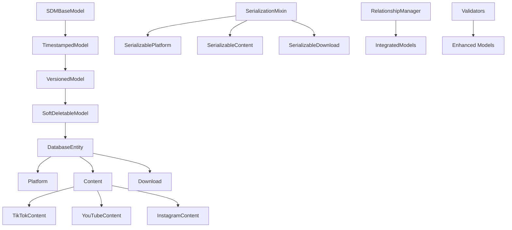

# Social Download Manager v2.0 - Data Models Documentation

## Overview

The Social Download Manager v2.0 data models system provides a comprehensive, type-safe, and feature-rich foundation for managing social media content, downloads, and platform-specific data. Built with Pydantic v2, the system offers advanced validation, serialization, relationship management, and extensibility.

## Architecture

### Core Components

```
data/models/
├── pydantic_models.py      # Base models and shared functionality
├── core_models.py          # Core business models
├── platform_models.py     # Platform-specific model extensions
├── validators.py           # Advanced validation logic
├── relationships.py        # Relationship management system
├── serializers.py          # Serialization/deserialization system
├── serialization_integration.py  # Enhanced models with serialization
├── model_integration.py    # Integrated models with relationships
├── test_models.py          # Comprehensive test suite
└── README.md              # This documentation
```

### System Architecture



## Base Model Hierarchy

### SDMBaseModel
The root base class providing core functionality:

```python
from data.models.pydantic_models import SDMBaseModel

class MyModel(SDMBaseModel):
    name: str
    value: int

# Automatic JSON serialization
model = MyModel(name="test", value=42)
json_str = model.to_json()
model2 = MyModel.from_json(json_str)
```

### TimestampedModel
Adds automatic timestamp management:

```python
from data.models.pydantic_models import TimestampedModel

class TimeAwareModel(TimestampedModel):
    name: str

model = TimeAwareModel(name="test")
print(model.created_at)  # Auto-set when created
model.mark_updated()     # Updates updated_at timestamp
```

### VersionedModel
Provides version tracking for optimistic locking:

```python
from data.models.pydantic_models import VersionedModel

class VersionedData(VersionedModel):
    content: str

model = VersionedData(content="initial")
print(model.version)  # 1
model.increment_version()
print(model.version)  # 2
```

### SoftDeletableModel
Enables soft deletion functionality:

```python
from data.models.pydantic_models import SoftDeletableModel

class DeletableModel(SoftDeletableModel):
    name: str

model = DeletableModel(name="test")
model.soft_delete()    # Marks as deleted
model.restore()        # Restores the record
```

### DatabaseEntity
Complete base for database-backed entities:

```python
from data.models.pydantic_models import DatabaseEntity

class MyEntity(DatabaseEntity):
    name: str
    
entity = MyEntity(name="test")
db_dict = entity.to_db_dict()    # Convert to database format
entity2 = MyEntity.from_db_dict(db_dict)  # Recreate from database
```

## Core Models

### Platform Model

Represents social media platforms:

```python
from data.models.core_models import Platform

platform = Platform(
    name="TikTok",
    base_url="https://www.tiktok.com",
    is_active=True,
    supported_content_types='["video", "image"]',
    api_endpoint="https://api.tiktok.com/v1",
    rate_limit_per_minute=100,
    requires_auth=True
)

# Computed properties
print(platform.is_social_media)  # True
print(platform.supports_video)   # True
```

### Content Model

Core content entity with engagement metrics:

```python
from data.models.core_models import Content, ContentType, ContentStatus

content = Content(
    platform_id=1,
    platform_content_id="tt_123456789",
    content_type=ContentType.VIDEO,
    title="Amazing TikTok Video",
    description="A really cool video",
    author_username="coolcreator",
    content_url="https://www.tiktok.com/@coolcreator/video/123456789",
    thumbnail_url="https://cdn.tiktok.com/thumb123.jpg",
    duration_seconds=45,
    view_count=1000000,
    like_count=50000,
    comment_count=5000,
    share_count=10000,
    status=ContentStatus.ACTIVE
)

# Computed properties
print(content.engagement_total)  # 65000 (like + comment + share)
print(content.is_downloadable)   # True
print(content.has_video)         # True
```

### Download Model

Download request tracking with progress monitoring:

```python
from data.models.core_models import Download, DownloadStatus

download = Download(
    content_id=1,
    requested_quality="high",
    requested_format="mp4",
    output_directory="/downloads",
    filename_template="{author}_{title}",
    status=DownloadStatus.QUEUED,
    priority="medium",
    progress_percentage=Decimal("0.0"),
    retry_count=0
)

# Computed properties
print(download.can_retry)           # True
print(download.estimated_time_remaining)  # Calculated based on progress
```

## Platform-Specific Models

### TikTok Content

Extended content model for TikTok-specific features:

```python
from data.models.platform_models import TikTokContent

tiktok_content = TikTokContent(
    # Base content fields...
    platform_id=1,
    platform_content_id="tt_123456789",
    content_type=ContentType.VIDEO,
    title="TikTok Dance Video",
    
    # TikTok-specific fields
    video_type="normal",
    music_title="Trending Song",
    music_author="Popular Artist",
    effects_used='["beauty", "dance_filter"]',
    hashtags='["dance", "viral", "trending"]',
    is_duet=False,
    is_stitch=False
)

# TikTok-specific computed properties
print(tiktok_content.is_duet_or_stitch)       # False
print(tiktok_content.total_tiktok_engagement)  # Sum of all engagement
```

### YouTube Content

Extended content model for YouTube features:

```python
from data.models.platform_models import YouTubeContent

youtube_content = YouTubeContent(
    # Base content fields...
    platform_id=2,
    platform_content_id="abc123def456",
    content_type=ContentType.VIDEO,
    title="Educational Video",
    
    # YouTube-specific fields
    video_type="normal",
    channel_id="UC123456789",
    channel_name="Educational Channel",
    category_id=27,  # Education
    has_captions=True,
    caption_languages='["en", "es", "fr"]',
    privacy_status="public",
    live_broadcast_content="none"
)

# YouTube-specific computed properties
print(youtube_content.is_live_content)  # False
print(youtube_content.is_short_form)    # Depends on duration
```

### Platform Model Factory

Dynamic model creation based on platform:

```python
from data.models.platform_models import PlatformModelFactory

# Create platform-specific content
tiktok_content = PlatformModelFactory.create_content('tiktok', content_data)
youtube_content = PlatformModelFactory.create_content('youtube', content_data)

# Get appropriate model class
TikTokContentClass = PlatformModelFactory.get_content_model('tiktok')
```

## Advanced Validation

### URL Validation

Comprehensive URL validation with platform-specific patterns:

```python
from data.models.validators import URLValidator

# Generic URL validation
is_valid = URLValidator.is_valid_url("https://www.tiktok.com/@user/video/123")

# Platform-specific validation
is_tiktok = URLValidator.is_valid_tiktok_url("https://www.tiktok.com/@user/video/123")
is_youtube = URLValidator.is_valid_youtube_url("https://youtube.com/watch?v=abc123")
is_instagram = URLValidator.is_valid_instagram_url("https://instagram.com/p/abc123/")

# Extract content ID from URL
content_id = URLValidator.extract_content_id("https://www.tiktok.com/@user/video/123456")
```

### JSON Validation

JSON schema validation and content verification:

```python
from data.models.validators import JSONValidator

# Basic JSON validation
is_valid = JSONValidator.is_valid_json('{"key": "value"}')

# Schema validation
schema = {"type": "object", "required": ["name"]}
is_valid = JSONValidator.validate_against_schema('{"name": "test"}', schema)

# Type-specific validation
hashtags = JSONValidator.validate_json_list('["tag1", "tag2"]', str)
```

### Business Rule Validation

High-level business logic validation:

```python
from data.models.validators import BusinessRuleValidator

# Content validation
content_data = {...}  # Content dictionary
errors = BusinessRuleValidator.validate_content_business_rules(content_data)

# Download validation  
download_data = {...}  # Download dictionary
errors = BusinessRuleValidator.validate_download_business_rules(download_data)

# Platform validation
platform_data = {...}  # Platform dictionary
errors = BusinessRuleValidator.validate_platform_business_rules(platform_data)
```

## Relationship Management

### Defining Relationships

Relationships are automatically configured based on the database schema:

```python
from data.models.relationships import get_relationship_manager

manager = get_relationship_manager()

# View all relationships
for rel_name, rel_config in manager.relationships.items():
    print(f"{rel_name}: {rel_config.relationship_type}")
```

### Using Integrated Models

Models with built-in relationship support:

```python
from data.models.model_integration import IntegratedPlatform, IntegratedContent

# Create platform with relationship support
platform = IntegratedPlatform(
    name="TikTok",
    base_url="https://www.tiktok.com",
    is_active=True
)

# Access related content (lazy-loaded)
contents = platform.contents  # Returns RelatedObjectsList

# Create content with relationships
content = IntegratedContent(
    platform_id=platform.id,
    title="Test Video",
    content_type="video"
)

# Add metadata
content.add_metadata("hashtags", ["viral", "funny"])

# Create download
download = content.create_download(quality="high", format="mp4")
```

### Cascade Operations

Automatic handling of relationship cascades:

```python
# Deleting a platform will handle related content based on cascade rules
platform.delete()  # Cascade rules determine what happens to related content

# Relationship validation
errors = content.validate_relationships()
if errors:
    print("Relationship validation failed:", errors)
```

## Serialization System

### Basic Serialization

All models support multiple serialization formats:

```python
from data.models.serialization_integration import SerializablePlatform

platform = SerializablePlatform(
    name="TikTok",
    base_url="https://www.tiktok.com"
)

# JSON serialization
json_str = platform.to_json(pretty=True)
platform2 = SerializablePlatform.from_json(json_str)

# Dictionary serialization
data_dict = platform.to_dict()
platform3 = SerializablePlatform.from_dict(data_dict)

# Database serialization
db_dict = platform.to_db_dict()
platform4 = SerializablePlatform.from_db_dict(db_dict)
```

### Format-Specific Serialization

Convert between different formats:

```python
from data.models.serializers import SerializationFormat

# Convert to specific format
json_data = platform.to_format(SerializationFormat.JSON)
db_data = platform.to_format(SerializationFormat.DATABASE)

# Create from specific format
platform2 = SerializablePlatform.from_format(json_data, SerializationFormat.JSON)
```

### File Export/Import

Direct file operations:

```python
from pathlib import Path

# Export single model
platform.export_to_file(Path("platform.json"))

# Import models
platforms = SerializablePlatform.import_from_file(Path("platform.json"))

# Bulk operations
from data.models.serialization_integration import BulkSerializationOperations

models = [platform1, platform2, content1]
BulkSerializationOperations.export_models_to_json(models, Path("bulk_export.json"))
```

### Schema Generation

Generate schemas for documentation and validation:

```python
# JSON schema
json_schema = SerializablePlatform.generate_schema('json', include_examples=True)

# Database schema
db_schema = SerializablePlatform.generate_schema('database')

# All schemas
from data.models.serialization_integration import generate_all_schemas
all_schemas = generate_all_schemas()
```

## Custom Serializers

### Creating Custom Serializers

```python
from data.models.serializers import BaseSerializer, SerializerFactory, SerializationFormat

class XMLSerializer(BaseSerializer):
    def serialize(self, instance, **kwargs):
        # Custom XML serialization logic
        pass
    
    def deserialize(self, data, **kwargs):
        # Custom XML deserialization logic
        pass

# Register custom serializer
SerializerFactory.register_serializer(SerializationFormat.XML, XMLSerializer)
```

### Custom Encoders/Decoders

```python
from data.models.serializers import CustomJSONEncoder, CustomJSONDecoder

# Custom type encoding
def encode_custom_type(obj):
    return {"__custom_type__": obj.value}

# Register custom encoder
encoder = CustomJSONEncoder()
encoder.register_encoder(MyCustomType, encode_custom_type)
```

## Testing

### Running Tests

```bash
# Run all model tests
pytest data/models/test_models.py -v

# Run specific test class
pytest data/models/test_models.py::TestCoreModels -v

# Run with coverage
pytest data/models/test_models.py --cov=data.models --cov-report=html
```

### Test Categories

The test suite covers:

- **Base Model Tests**: Core functionality of base model hierarchy
- **Core Model Tests**: Business logic and computed properties
- **Platform Model Tests**: Platform-specific functionality
- **Validation Tests**: All validation logic and rules
- **Relationship Tests**: Relationship management and cascades
- **Serialization Tests**: All serialization formats and operations
- **Integration Tests**: End-to-end integration scenarios
- **Performance Tests**: Performance characteristics and benchmarks
- **Error Handling Tests**: Error scenarios and edge cases

### Writing Custom Tests

```python
import pytest
from data.models.core_models import Platform

def test_my_custom_functionality():
    """Test custom platform functionality"""
    platform = Platform(
        name="Custom Platform",
        base_url="https://custom.com"
    )
    
    # Your test logic here
    assert platform.name == "Custom Platform"
```

## Usage Examples

### Complete Content Workflow

```python
from data.models.serialization_integration import (
    SerializablePlatform, SerializableContent, SerializableDownload
)
from data.models.core_models import ContentType, DownloadStatus

# 1. Create platform
platform = SerializablePlatform(
    name="TikTok",
    base_url="https://www.tiktok.com",
    is_active=True,
    supported_content_types='["video", "image"]'
)

# 2. Create content
content = SerializableContent(
    platform_id=1,  # Would be platform.id in real scenario
    platform_content_id="tt_123456789",
    content_type=ContentType.VIDEO,
    title="Viral Dance Video",
    description="Amazing dance moves",
    author_username="dancer123",
    content_url="https://www.tiktok.com/@dancer123/video/123456789",
    view_count=1000000,
    like_count=50000
)

# 3. Create download request
download = SerializableDownload(
    content_id=1,  # Would be content.id in real scenario
    requested_quality="high",
    requested_format="mp4",
    status=DownloadStatus.QUEUED
)

# 4. Export workflow data
workflow_data = {
    'platform': platform.to_dict(),
    'content': content.to_dict(),
    'download': download.to_dict()
}

# 5. API-ready serialization
api_content = content.to_api_dict(include_metadata=True)
status_update = download.to_status_dict()
```

### Platform-Specific Content Creation

```python
from data.models.platform_models import PlatformModelFactory

# TikTok content with platform-specific features
tiktok_data = {
    'platform_id': 1,
    'platform_content_id': 'tt_123',
    'content_type': 'video',
    'title': 'Dance Challenge',
    'video_type': 'normal',
    'music_title': 'Trending Song',
    'hashtags': '["dance", "viral"]',
    'is_duet': False
}

tiktok_content = PlatformModelFactory.create_content('tiktok', tiktok_data)
print(f"TikTok engagement: {tiktok_content.total_tiktok_engagement}")

# YouTube content with different features
youtube_data = {
    'platform_id': 2,
    'platform_content_id': 'yt_abc123',
    'content_type': 'video',
    'title': 'Educational Video',
    'channel_id': 'UC123456789',
    'has_captions': True,
    'caption_languages': '["en", "es"]'
}

youtube_content = PlatformModelFactory.create_content('youtube', youtube_data)
print(f"Is short form: {youtube_content.is_short_form}")
```

### Bulk Operations

```python
from data.models.model_integration import BulkOperations, IntegratedModelFactory

# Create multiple platforms
platform_data_list = [
    {'name': 'TikTok', 'base_url': 'https://tiktok.com'},
    {'name': 'YouTube', 'base_url': 'https://youtube.com'},
    {'name': 'Instagram', 'base_url': 'https://instagram.com'}
]

platforms = [
    IntegratedModelFactory.create_model('platform', data) 
    for data in platform_data_list
]

# Bulk validation and creation
results = BulkOperations.bulk_create(platforms, validate_relationships=True)
print(f"Created {len(results)} platforms")

# Bulk export
from pathlib import Path
success = BulkOperations.bulk_export(platforms, Path("platforms.json"))
```

## Best Practices

### Model Design

1. **Use Type Hints**: Always use proper type hints for better IDE support and validation
2. **Leverage Computed Properties**: Use `@computed_field` for derived values
3. **Validate Early**: Implement validation at the model level
4. **Use Enums**: Define enums for constrained string values
5. **Document Fields**: Use `Field()` with descriptions for better documentation

```python
from pydantic import Field, computed_field
from typing import Optional
from decimal import Decimal

class BestPracticeModel(DatabaseEntity):
    """Example model following best practices"""
    
    name: str = Field(..., description="Human-readable name", min_length=1, max_length=100)
    value: Optional[Decimal] = Field(None, description="Optional decimal value", ge=0)
    status: ContentStatus = Field(ContentStatus.DRAFT, description="Current status")
    
    @computed_field
    @property
    def display_name(self) -> str:
        """Formatted display name"""
        return f"{self.name} ({self.status.value})"
```

### Validation Guidelines

1. **Layer Validation**: Use field validators, model validators, and business rule validators
2. **Clear Error Messages**: Provide descriptive error messages
3. **Performance**: Keep validation efficient for bulk operations
4. **Consistency**: Use consistent validation patterns across models

### Serialization Best Practices

1. **Format Selection**: Choose appropriate serialization format for use case
2. **Versioning**: Include version information in serialized data
3. **Error Handling**: Handle serialization errors gracefully
4. **Performance**: Use bulk operations for multiple instances
5. **Schema Evolution**: Design schemas to handle future changes

### Testing Guidelines

1. **Comprehensive Coverage**: Test all model functionality
2. **Edge Cases**: Include tests for edge cases and error conditions
3. **Performance**: Include performance tests for critical operations
4. **Integration**: Test model integration with other components
5. **Documentation**: Use descriptive test names and docstrings

## Troubleshooting

### Common Issues

1. **Validation Errors**: Check field types and constraints
2. **Serialization Failures**: Verify custom types have appropriate encoders
3. **Relationship Errors**: Ensure proper relationship configuration
4. **Performance Issues**: Use bulk operations for large datasets

### Debugging Tips

```python
# Enable detailed logging
import logging
logging.basicConfig(level=logging.DEBUG)

# Validate individual fields
from pydantic import ValidationError
try:
    model = MyModel(**data)
except ValidationError as e:
    print(e.errors())

# Check serialization roundtrip
model = MyModel(**data)
is_valid = model.validate_serialization_roundtrip()
```

## Migration Guide

### From v1.x Models

1. **Update Imports**: Change imports to use new model modules
2. **Field Validation**: Update field validation to use new validators
3. **Serialization**: Replace custom serialization with built-in system
4. **Relationships**: Use new relationship management system
5. **Testing**: Update tests to use new test patterns

### Breaking Changes

- Model inheritance hierarchy changed
- Serialization format updated
- Validation rules enhanced
- Relationship API redesigned

## API Reference

### Core Classes

- `SDMBaseModel`: Base model with JSON serialization
- `TimestampedModel`: Automatic timestamp management
- `VersionedModel`: Version tracking for optimistic locking
- `SoftDeletableModel`: Soft deletion capability
- `DatabaseEntity`: Complete database entity base

### Platform Models

- `Platform`: Social media platform representation
- `Content`: Generic content model
- `TikTokContent`: TikTok-specific content
- `YouTubeContent`: YouTube-specific content
- `InstagramContent`: Instagram-specific content

### Utility Classes

- `URLValidator`: URL validation and extraction
- `JSONValidator`: JSON validation and schema checking
- `BusinessRuleValidator`: High-level business logic validation
- `RelationshipManager`: Relationship management and cascades
- `SerializerFactory`: Serializer creation and registration

## Contributing

### Adding New Platforms

1. Create platform-specific model class
2. Implement platform-specific validation
3. Add to `PlatformModelFactory`
4. Write comprehensive tests
5. Update documentation

### Extending Functionality

1. Follow existing patterns and conventions
2. Implement comprehensive tests
3. Update documentation
4. Consider backward compatibility
5. Add type hints and docstrings

---

For more information, see the individual module documentation and test files. 