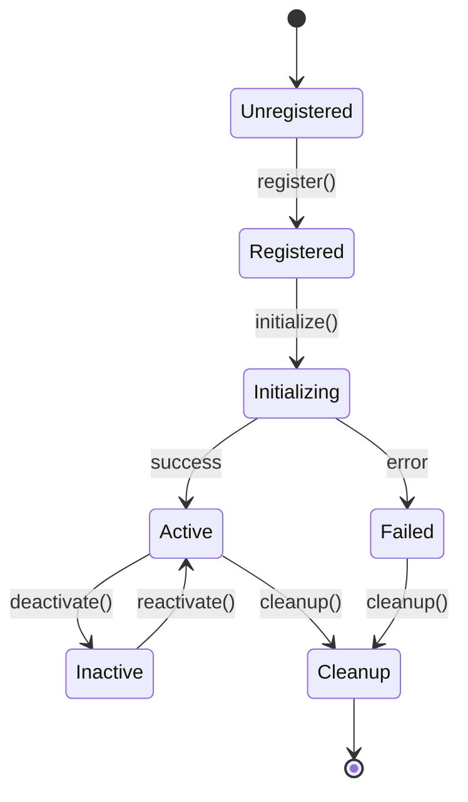

# Architecture Bridge Documentation
### UI v1.2.1 to v2.0 Migration Guide

## 📋 Table of Contents

1. [Architecture Overview](#architecture-overview)
2. [Adapter Pattern Implementation](#adapter-pattern-implementation)
3. [Cross-Component Event Coordination](#cross-component-event-coordination)
4. [App Controller Integration](#app-controller-integration)
5. [Central Feature Flag Management](#central-feature-flag-management)
6. [Migration Guide](#migration-guide)
7. [API Reference](#api-reference)
8. [Troubleshooting](#troubleshooting)
9. [Performance Considerations](#performance-considerations)
10. [Developer Guide](#developer-guide)

---

## 🏗️ Architecture Overview

The Architecture Bridge is a comprehensive system designed to facilitate a smooth transition from UI v1.2.1 to v2.0 while maintaining system stability and user experience. The bridge implements several key patterns:

### Core Components

```
📦 Architecture Bridge System
├── 🔌 Adapter Pattern Implementation
│   ├── Base Adapter Interfaces
│   ├── MainWindow Adapter
│   ├── VideoInfoTab Adapter
│   └── DownloadedVideosTab Adapter
├── 🌐 Cross-Component Event Coordination
│   ├── Event Sequences & Workflows
│   ├── Event Throttling & Debouncing
│   └── Component State Management
├── 🎛️ App Controller Integration
│   ├── Adapter Lifecycle Management
│   ├── Health Monitoring
│   └── Fallback Mechanisms
└── 🚀 Feature Flag Management
    ├── Centralized Configuration
    ├── Runtime Modification
    └── Migration Presets
```

### Design Principles

- **Gradual Migration**: Support phased transition between versions
- **Backward Compatibility**: v1.2.1 components continue working during transition
- **Event-Driven Architecture**: Loose coupling through event coordination
- **Fault Tolerance**: Comprehensive fallback and recovery mechanisms
- **Performance Monitoring**: Real-time metrics and health checks

---

## 🔌 Adapter Pattern Implementation

### Base Interfaces

The adapter system is built on standardized interfaces defined in `ui/adapters/interfaces.py`:

```python
from abc import ABC, abstractmethod
from typing import Any, Dict, Optional
from PyQt6.QtWidgets import QWidget

class BaseAdapter(ABC):
    """Base interface for all UI adapters"""
    
    @abstractmethod
    def initialize(self) -> bool:
        """Initialize the adapter"""
        pass
    
    @abstractmethod
    def cleanup(self) -> bool:
        """Clean up adapter resources"""
        pass
    
    @abstractmethod
    def get_health_status(self) -> Dict[str, Any]:
        """Get adapter health information"""
        pass
```

### Component-Specific Adapters

#### MainWindow Adapter
**Purpose**: Bridges the main application window between v1.2.1 and v2.0

**Key Features**:
- Seamless UI layout transitions
- Menu system adaptation
- Status bar bridging
- Window state management

```python
# Example usage
from ui.adapters.main_window_adapter import MainWindowAdapter

adapter = MainWindowAdapter(v1_window, v2_components)
adapter.initialize()
adapter.bridge_menu_system()
adapter.update_status_bar("Migration in progress...")
```

#### VideoInfoTab Adapter
**Purpose**: Manages video information display and editing during transition

**Key Features**:
- Data model bridging
- UI component mapping
- Event forwarding
- State synchronization

#### DownloadedVideosTab Adapter
**Purpose**: Handles downloaded videos list and management

**Key Features**:
- Table widget adaptation
- Filter system bridging
- Action button mapping
- Progress indicator bridging

### Adapter Lifecycle



---

## 🌐 Cross-Component Event Coordination

The event coordination system (`ui/adapters/cross_component_coordinator.py`) provides sophisticated event management for the bridge.

### Event Sequences

Event sequences allow for complex multi-step operations:

```python
from ui.adapters.cross_component_coordinator import EventSequence, EventSequenceStep

# Define migration sequence
migration_sequence = EventSequence(
    sequence_id="ui_migration",
    description="Complete UI migration sequence"
)

# Add steps
migration_sequence.add_step(EventSequenceStep(
    step_id="prepare_v2",
    event_type="migration.prepare",
    target_component="ui_manager",
    data={"version": "2.0"},
    timeout=30.0
))

migration_sequence.add_step(EventSequenceStep(
    step_id="transfer_state",
    event_type="state.transfer",
    target_component="state_manager",
    dependencies=["prepare_v2"]
))
```

### Event Throttling & Debouncing

```python
from ui.adapters.cross_component_coordinator import ThrottleConfig, ThrottleStrategy

# Configure throttling for high-frequency events
throttle_config = ThrottleConfig(
    strategy=ThrottleStrategy.DEBOUNCE,
    interval_ms=500,
    max_batch_size=10
)

coordinator.set_event_throttling("ui.update", throttle_config)
```

### Component State Management

The system tracks component states and manages dependencies:

```python
# Check component readiness
if coordinator.is_component_ready("main_window_adapter"):
    coordinator.trigger_event("migration.start", {"phase": "1"})
```

---

## 🎛️ App Controller Integration

### Adapter Manager

The `AdapterManager` (`ui/adapters/adapter_manager.py`) provides centralized lifecycle management:

```python
from ui.adapters.adapter_manager import AdapterManager

# Initialize adapter manager
manager = AdapterManager(app_controller)

# Register adapters
manager.register_adapter("main_window", MainWindowAdapter())
manager.register_adapter("video_info", VideoInfoTabAdapter())

# Start health monitoring
manager.start_health_monitoring(interval=30)  # 30-second intervals
```

### Health Monitoring

Automatic health checks detect issues and trigger fallbacks:

```python
# Health check results
{
    "adapter_id": "main_window",
    "status": "healthy",
    "last_check": "2025-06-02T18:30:00Z",
    "metrics": {
        "response_time_ms": 45.2,
        "memory_usage_mb": 23.1,
        "error_count": 0
    }
}
```

### Fallback Mechanisms

The `FallbackManager` provides multiple strategies:

1. **Graceful Degradation**: Reduce functionality while maintaining core features
2. **Retry with Backoff**: Automatic retry with exponential backoff
3. **Skip Component**: Bypass failing component temporarily
4. **Fail Fast**: Immediate failure for critical components
5. **Manual Intervention**: Request user action for resolution

```python
from ui.adapters.adapter_manager import FallbackStrategy

# Configure fallback
manager.configure_fallback("video_info", FallbackStrategy.GRACEFUL_DEGRADATION)
```

---

## 🚀 Central Feature Flag Management

The Feature Flag Management System (`ui/adapters/feature_flag_manager.py`) controls the migration process.

### Basic Usage

```python
from ui.adapters.feature_flag_manager import FeatureFlagManager

# Initialize manager
flag_manager = FeatureFlagManager()

# Check feature availability
if flag_manager.is_feature_available("v2_architecture"):
    # Use v2.0 components
    use_v2_components()
else:
    # Fallback to v1.2.1
    use_v1_components()
```

### Migration Presets

```python
# Load development preset
flag_manager.load_preset("development")

# Load production preset with safety features
flag_manager.load_preset("production")

# Emergency safe mode
flag_manager.load_preset("safe_mode")
```

### Flag Categories

| Category | Description | Examples |
|----------|-------------|----------|
| `architecture` | Core architectural changes | `enable_v2_architecture` |
| `adapters` | Adapter enabling/disabling | `enable_main_window_adapter` |
| `migration` | Migration process control | `migration_phase` |
| `safety` | Safety and fallback features | `rollback_enabled`, `enable_graceful_degradation` |
| `debug` | Development and debugging | `enable_debug_mode` |
| `performance` | Performance optimizations | `enable_video_caching` |

---

## 📖 Migration Guide

### Phase 1: Preparation

1. **Initialize the Bridge System**
   ```bash
   # Verify system readiness
   python scripts/verify_migration_readiness.py
   
   # Initialize adapters
   python scripts/initialize_adapters.py
   ```

2. **Configure Feature Flags**
   ```python
   # Set initial configuration
   flag_manager.load_preset("development")
   flag_manager.set_flag("migration_phase", "preparation")
   ```

### Phase 2: Gradual Migration

1. **Enable Component Adapters**
   ```python
   # Start with non-critical components
   flag_manager.set_flag("enable_video_info_adapter", True)
   
   # Monitor health
   health = adapter_manager.get_adapter_health("video_info")
   ```

2. **Transfer State Data**
   ```python
   # Trigger state transfer
   coordinator.trigger_event_sequence("state_migration")
   ```

### Phase 3: Full Transition

1. **Enable Core Adapters**
   ```python
   flag_manager.set_flag("enable_main_window_adapter", True)
   flag_manager.set_flag("migration_phase", "complete")
   ```

2. **Cleanup Legacy Components**
   ```python
   adapter_manager.cleanup_legacy_components()
   ```

### Rollback Procedure

```python
# Emergency rollback
flag_manager.load_preset("safe_mode")
adapter_manager.initiate_rollback()

# Verify rollback success
status = adapter_manager.get_system_health()
```

---

## 📚 API Reference

### AdapterManager

#### Methods

| Method | Description | Parameters | Returns |
|--------|-------------|------------|---------|
| `register_adapter()` | Register new adapter | `adapter_id: str, adapter: BaseAdapter` | `bool` |
| `get_adapter_health()` | Get adapter health | `adapter_id: str` | `Dict[str, Any]` |
| `start_health_monitoring()` | Start monitoring | `interval: int = 30` | `None` |
| `initiate_fallback()` | Trigger fallback | `adapter_id: str, reason: str` | `bool` |

### CrossComponentCoordinator

#### Methods

| Method | Description | Parameters | Returns |
|--------|-------------|------------|---------|
| `trigger_event()` | Trigger single event | `event_type: str, data: Dict` | `bool` |
| `trigger_event_sequence()` | Trigger sequence | `sequence_id: str` | `bool` |
| `set_event_throttling()` | Configure throttling | `event_type: str, config: ThrottleConfig` | `None` |
| `is_component_ready()` | Check readiness | `component_id: str` | `bool` |

### FeatureFlagManager

#### Methods

| Method | Description | Parameters | Returns |
|--------|-------------|------------|---------|
| `get_flag()` | Get flag value | `flag_name: str, default: Any = None` | `Any` |
| `set_flag()` | Set flag value | `flag_name: str, value: Any` | `bool` |
| `is_feature_available()` | Check feature | `feature_name: str` | `bool` |
| `load_preset()` | Load preset | `preset_name: str` | `bool` |

---

## 🔧 Troubleshooting

### Common Issues

#### Adapter Initialization Failures

**Symptoms**: Adapter fails to initialize during startup

**Causes**:
- Missing dependencies
- Configuration errors
- Resource conflicts

**Solutions**:
```python
# Check adapter dependencies
manager.validate_adapter_dependencies("main_window")

# Reset adapter configuration
manager.reset_adapter_config("main_window")

# Force reinitialization
manager.force_reinitialize("main_window")
```

#### Event Coordination Problems

**Symptoms**: Events not reaching target components

**Causes**:
- Component not registered
- Event throttling blocking events
- Sequence dependencies not met

**Solutions**:
```python
# Check component registration
if not coordinator.is_component_registered("ui_manager"):
    coordinator.register_component("ui_manager", ui_manager_instance)

# Clear throttling
coordinator.clear_throttling("ui.update")

# Debug event flow
coordinator.enable_debug_tracing(True)
```

#### Feature Flag Conflicts

**Symptoms**: Unexpected behavior after flag changes

**Causes**:
- Flag dependency violations
- Invalid flag combinations
- Cached flag values

**Solutions**:
```python
# Validate flag dependencies
validation_result = flag_manager.validate_all_dependencies()

# Clear flag cache
flag_manager.clear_cache()

# Reset to safe configuration
flag_manager.load_preset("safe_mode")
```

### Diagnostic Tools

```python
# Generate comprehensive system report
report = bridge_system.generate_diagnostic_report()

# Check system health
health_status = bridge_system.get_overall_health()

# Export configuration for analysis
config = bridge_system.export_configuration()
```

---

## ⚡ Performance Considerations

### Memory Management

- **Adapter Instances**: Reuse adapter instances where possible
- **Event Cleanup**: Regularly clean up old event objects
- **State Caching**: Cache frequently accessed state data

```python
# Configure memory limits
adapter_manager.set_memory_limits({
    "max_event_history": 1000,
    "max_cached_states": 50,
    "cleanup_interval": 300  # 5 minutes
})
```

### Event Performance

- **Throttling**: Use appropriate throttling for high-frequency events
- **Batching**: Batch similar events when possible
- **Async Processing**: Process non-critical events asynchronously

```python
# Optimize event processing
coordinator.configure_event_processing({
    "async_processing": True,
    "batch_size": 10,
    "processing_interval": 100  # ms
})
```

### Resource Monitoring

```python
# Monitor resource usage
metrics = bridge_system.get_performance_metrics()
# {
#     "memory_usage_mb": 45.2,
#     "cpu_usage_percent": 12.5,
#     "event_processing_time_ms": 23.1,
#     "adapter_response_time_ms": 67.8
# }
```

---

## 👨‍💻 Developer Guide

### Creating Custom Adapters

1. **Inherit from BaseAdapter**:
```python
from ui.adapters.interfaces import BaseAdapter

class CustomAdapter(BaseAdapter):
    def __init__(self, v1_component, v2_component):
        super().__init__()
        self.v1_component = v1_component
        self.v2_component = v2_component
    
    def initialize(self) -> bool:
        # Custom initialization logic
        return True
    
    def cleanup(self) -> bool:
        # Custom cleanup logic
        return True
    
    def get_health_status(self) -> Dict[str, Any]:
        # Health check implementation
        return {"status": "healthy"}
```

2. **Register with AdapterManager**:
```python
adapter_manager.register_adapter("custom", CustomAdapter(v1_comp, v2_comp))
```

### Extending Event Coordination

1. **Create Custom Event Types**:
```python
# Define custom events
CUSTOM_EVENTS = {
    "data.sync": "Synchronize data between components",
    "ui.refresh": "Refresh UI components",
    "state.backup": "Backup current state"
}

coordinator.register_event_types(CUSTOM_EVENTS)
```

2. **Implement Event Handlers**:
```python
def handle_data_sync(event_data):
    # Custom synchronization logic
    source_data = event_data.get("source")
    target_component = event_data.get("target")
    # ... sync logic

coordinator.register_event_handler("data.sync", handle_data_sync)
```

### Testing Strategies

1. **Unit Testing Adapters**:
```python
import unittest
from unittest.mock import Mock

class TestCustomAdapter(unittest.TestCase):
    def setUp(self):
        self.mock_v1 = Mock()
        self.mock_v2 = Mock()
        self.adapter = CustomAdapter(self.mock_v1, self.mock_v2)
    
    def test_initialization(self):
        result = self.adapter.initialize()
        self.assertTrue(result)
```

2. **Integration Testing**:
```python
def test_full_migration_flow():
    # Test complete migration process
    bridge_system.initialize()
    bridge_system.start_migration()
    
    # Verify final state
    assert bridge_system.get_migration_status() == "complete"
```

### Best Practices

1. **Error Handling**: Always implement comprehensive error handling
2. **Logging**: Use structured logging for debugging
3. **Documentation**: Document all custom components
4. **Testing**: Maintain high test coverage
5. **Performance**: Monitor and optimize resource usage

---

## 📋 Configuration Reference

### Feature Flag Configuration

```json
{
  "feature_flags": {
    "enable_v2_architecture": {
      "value": true,
      "type": "boolean",
      "scope": "global",
      "description": "Enable v2.0 architecture components"
    },
    "migration_phase": {
      "value": "gradual",
      "type": "string",
      "scope": "global",
      "valid_values": ["gradual", "big_bang", "user_controlled"]
    }
  }
}
```

### Adapter Configuration

```json
{
  "adapters": {
    "main_window": {
      "enabled": true,
      "health_check_interval": 30,
      "fallback_strategy": "graceful_degradation"
    },
    "video_info": {
      "enabled": true,
      "health_check_interval": 60,
      "fallback_strategy": "retry_with_backoff"
    }
  }
}
```

### Event Configuration

```json
{
  "event_coordination": {
    "default_timeout": 5000,
    "max_sequence_steps": 50,
    "throttling": {
      "ui.update": {
        "strategy": "debounce",
        "interval_ms": 500
      }
    }
  }
}
```

---

## 🚨 Emergency Procedures

### System Rollback

```python
# Complete system rollback
def emergency_rollback():
    # 1. Load safe mode configuration
    flag_manager.load_preset("safe_mode")
    
    # 2. Stop all adapters
    adapter_manager.stop_all_adapters()
    
    # 3. Clear event queues
    coordinator.clear_all_event_queues()
    
    # 4. Restart with v1.2.1 only
    adapter_manager.start_legacy_mode()
    
    # 5. Verify system stability
    return bridge_system.verify_stability()
```

### Data Recovery

```python
# Recover from data corruption
def recover_system_state():
    # 1. Load last known good state
    state = bridge_system.load_backup_state()
    
    # 2. Validate state integrity
    if not bridge_system.validate_state(state):
        state = bridge_system.get_default_state()
    
    # 3. Apply state to system
    bridge_system.restore_state(state)
    
    return True
```

---

## 📊 Monitoring & Metrics

### Key Metrics

| Metric | Description | Target |
|--------|-------------|--------|
| Adapter Uptime | Percentage of time adapters are healthy | > 99% |
| Event Processing Time | Average time to process events | < 100ms |
| Migration Progress | Percentage of migration completed | Tracked |
| Error Rate | Number of errors per hour | < 5 |
| Memory Usage | Memory consumption by bridge system | < 100MB |

### Monitoring Dashboard

```python
# Get real-time metrics
dashboard_data = {
    "system_health": bridge_system.get_health_summary(),
    "adapter_status": adapter_manager.get_all_adapter_status(),
    "feature_flags": flag_manager.get_active_flags(),
    "recent_events": coordinator.get_recent_events(limit=100),
    "performance_metrics": bridge_system.get_performance_summary()
}
```

---

## 📝 Conclusion

The Architecture Bridge System provides a robust, scalable solution for migrating from UI v1.2.1 to v2.0 while maintaining system stability and user experience. The comprehensive adapter pattern, event coordination, feature flag management, and monitoring capabilities ensure a smooth transition process.

For additional support or questions, refer to the troubleshooting section or contact the development team.

---

**Document Version**: 1.0  
**Last Updated**: 2025-06-02  
**Authors**: Architecture Bridge Team  
**Status**: Complete 