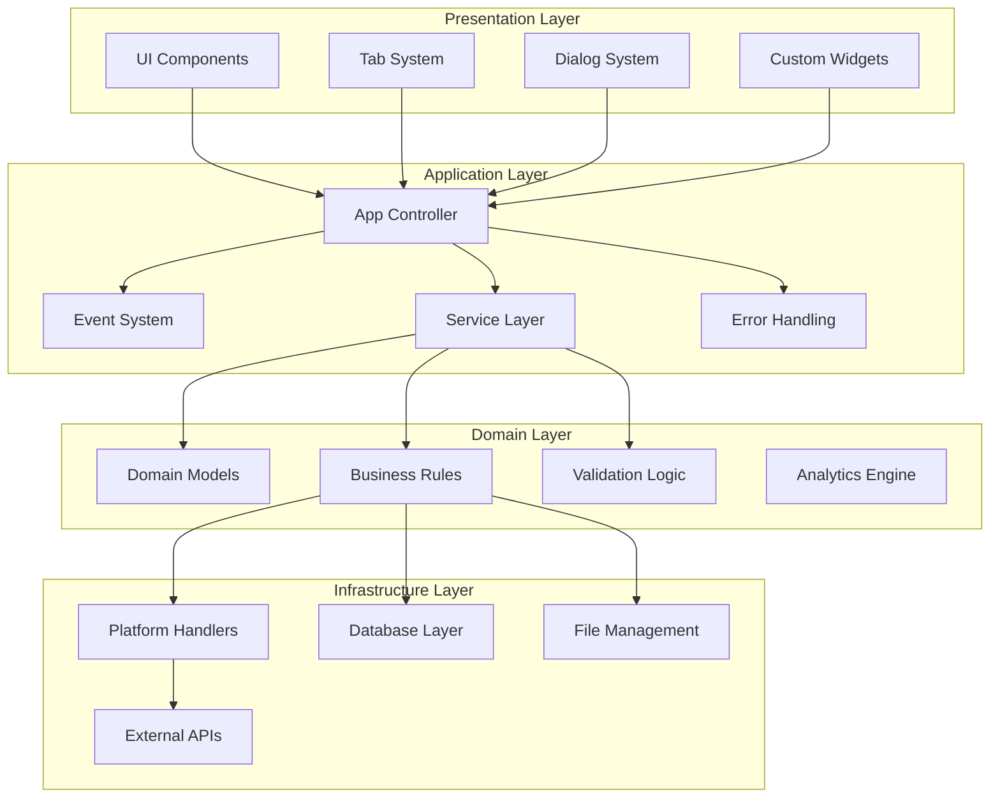
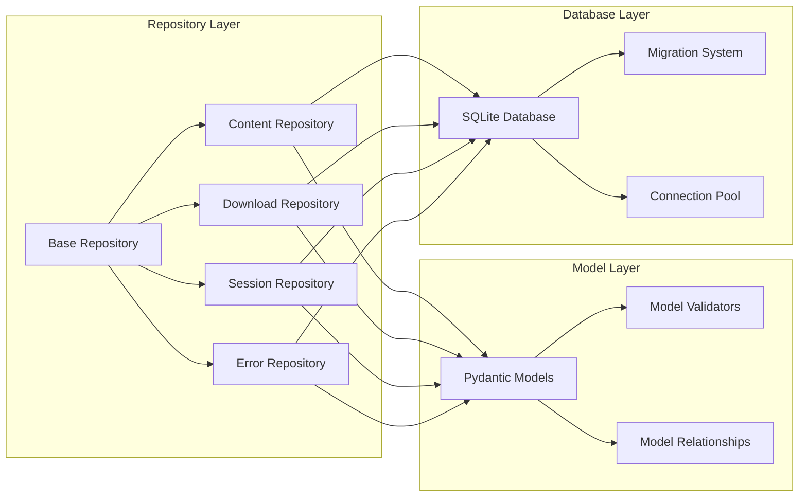
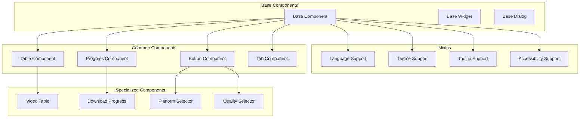
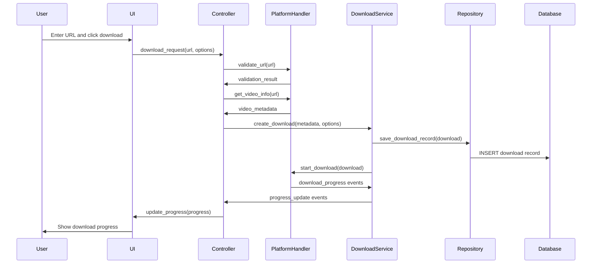
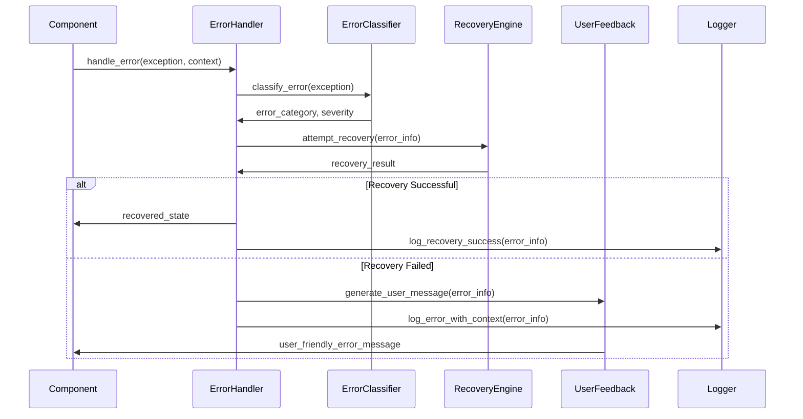

# Social Download Manager v2.0 - Architecture Overview

## Table of Contents
- [System Overview](#system-overview)
- [Design Principles](#design-principles)
- [Architecture Layers](#architecture-layers)
- [Component Architecture](#component-architecture)
- [Data Flow and Integration](#data-flow-and-integration)
- [Security Architecture](#security-architecture)
- [Scalability and Extensibility](#scalability-and-extensibility)
- [Technology Stack](#technology-stack)
- [Deployment Architecture](#deployment-architecture)

## System Overview

Social Download Manager v2.0 is a comprehensive multi-platform social media content management application designed with enterprise-grade architecture patterns. The system enables users to download, manage, and organize content from multiple social media platforms including TikTok, YouTube, Instagram, and more.

### System Goals

**Primary Objectives:**
- **Multi-platform Support**: Unified interface for downloading content from various social media platforms
- **Scalable Architecture**: Modular design that allows easy addition of new platforms and features
- **User Experience**: Intuitive, responsive UI with accessibility compliance (WCAG 2.1 AA)
- **Performance**: High-performance download management with concurrent processing
- **Reliability**: Robust error handling with automatic recovery mechanisms
- **Security**: Secure handling of user credentials and downloaded content

**Key Features:**
- Multi-platform content downloading (TikTok, YouTube, Instagram, Facebook)
- Advanced download management with queue, progress tracking, and resumption
- Content organization with tagging, filtering, and search capabilities
- Batch operations for bulk downloads and management
- Quality selection and format conversion
- Multi-language support with localization framework
- Theme support with light/dark modes
- Analytics and reporting for download activity

## Design Principles

### 1. **Clean Architecture**
The application follows clean architecture principles with clear separation of concerns:
- **Domain Layer**: Core business logic independent of external dependencies
- **Application Layer**: Use cases and business rules orchestration
- **Interface Adapters**: Controllers, presenters, and gateways
- **Infrastructure Layer**: External frameworks, databases, and services

### 2. **Event-Driven Architecture**
- **Loose Coupling**: Components communicate through events, reducing direct dependencies
- **Scalability**: Event-driven patterns support horizontal scaling and async processing
- **Maintainability**: Events provide clear boundaries between components

### 3. **Repository Pattern**
- **Data Abstraction**: Clean separation between business logic and data access
- **Testability**: Easy mocking of data sources for unit testing
- **Flexibility**: Support for multiple data sources and caching strategies

### 4. **Modular Design**
- **Platform Handlers**: Pluggable architecture for adding new social media platforms
- **UI Components**: Reusable, composable UI components with consistent APIs
- **Service Layer**: Modular services for different business capabilities

### 5. **Error-First Design**
- **Comprehensive Error Handling**: 11-category error classification system
- **Automatic Recovery**: 15 recovery strategies with intelligent fallback
- **User-Friendly Feedback**: Context-aware error messages for different user roles

## Architecture Layers



### Presentation Layer
**Responsibilities**: User interface, user interactions, presentation logic
**Components**:
- **Main Window**: Primary application interface with tab-based navigation
- **Tab System**: Modular tabs for different functionalities (Download, History, Analytics)
- **Custom Components**: Reusable UI components (tables, buttons, progress bars)
- **Dialog System**: Modal dialogs for settings, confirmations, and detailed views

**Technologies**: PyQt6, QML, Qt Designer, Custom styling framework

### Application Layer
**Responsibilities**: Orchestration, coordination, application services
**Components**:
- **App Controller**: Central coordinator implementing clean architecture patterns
- **Event System**: Publisher/subscriber pattern for component communication
- **Service Layer**: Business capability services (Content, Download, Analytics)
- **Error Handling**: Comprehensive error management with recovery strategies

**Key Patterns**: Command pattern, Observer pattern, Strategy pattern

### Domain Layer
**Responsibilities**: Core business logic, domain rules, entities
**Components**:
- **Domain Models**: Core entities (Content, Download, Platform, User)
- **Business Rules**: Platform-specific logic, validation rules, business constraints
- **Analytics Engine**: Data analysis, reporting, insights generation
- **Validators**: Input validation, business rule validation

**Characteristics**: Framework-independent, highly testable, pure business logic

### Infrastructure Layer
**Responsibilities**: External systems integration, data persistence, I/O operations
**Components**:
- **Platform Handlers**: Pluggable handlers for each social media platform
- **Database Layer**: SQLite with migration system and repository pattern
- **File Management**: Download storage, media organization, file operations
- **External APIs**: Third-party service integrations (yt-dlp, platform APIs)

## Component Architecture

### Core Components

#### 1. App Controller (`core/app_controller.py`)
**Role**: Central orchestrator and dependency injection container
**Responsibilities**:
- Component lifecycle management
- Service registry and dependency injection
- Event system coordination
- Error handling orchestration
- Configuration management

**Key Features**:
- Thread-safe operations with proper synchronization
- Graceful startup and shutdown procedures
- Health monitoring and diagnostics
- Component isolation and fault tolerance

#### 2. Event System (`core/event_system.py`)
**Role**: Event-driven communication backbone
**Components**:
- **EventBus**: Central message broker with type-safe event handling
- **Event Types**: Categorized events (UI, Download, Platform, Error, Analytics)
- **Event Handlers**: Async and sync event processing
- **Event Registry**: Dynamic subscription management

**Patterns**:
- Publisher/Subscriber with strong typing
- Event sourcing for audit trails
- Circuit breaker for error isolation

#### 3. Platform Factory (`core/platform_factory.py`)
**Role**: Platform handler management and instantiation
**Features**:
- **Dynamic Registration**: Runtime platform handler registration
- **Capability Discovery**: Platform feature detection and validation
- **Factory Pattern**: Consistent platform handler creation
- **Plugin Architecture**: Support for external platform handlers

#### 4. Data Integration Layer (`core/data_integration/`)
**Components**:
- **Repository Event Integration**: Events for data changes
- **Async Loading Patterns**: Non-blocking data operations
- **State Synchronization**: UI and data layer state consistency
- **Download Management Integration**: Real-time download progress

### Platform Handlers

#### TikTok Handler (`platforms/tiktok/`)
**Features**:
- **Enhanced API Integration**: Multiple extraction methods with fallback
- **Performance Optimization**: Caching, connection pooling, concurrent downloads
- **Quality Selection**: Multiple quality options with intelligent defaults
- **Metadata Extraction**: Comprehensive video information extraction

#### YouTube Handler (`platforms/youtube/`)
**Current State**: Stub implementation with basic structure
**Planned Features**:
- YouTube API integration with quota management
- Playlist and channel support
- Live stream download capabilities
- Subtitle and closed caption extraction

### Data Layer

#### Repository Pattern Implementation


#### Database Schema
**Content Table**: Video metadata, platform information, download status
**Download Table**: Download records, progress tracking, file information
**Session Table**: User sessions, application state, preferences
**Error Table**: Error logs, categorization, recovery attempts
**Migration Table**: Schema version tracking, migration history

### UI Component Architecture

#### Component Hierarchy


## Data Flow and Integration

### Primary Data Flows

#### 1. Content Download Flow


#### 2. Error Handling Flow


### Integration Points

#### 1. External Service Integration
- **yt-dlp**: Video information extraction and download capabilities
- **FFmpeg**: Media format conversion and processing
- **Platform APIs**: Official API integrations where available
- **Update Services**: Automatic update checking and distribution

#### 2. Database Integration
- **SQLite**: Primary data storage with WAL mode for concurrent access
- **Migration System**: Automatic schema upgrades with rollback support
- **Connection Pooling**: Efficient database connection management
- **Transaction Management**: ACID compliance with proper error handling

#### 3. File System Integration
- **Download Management**: Organized file storage with metadata
- **Temporary Files**: Secure handling of temporary download files
- **Cache Management**: Intelligent caching of metadata and thumbnails
- **Backup Systems**: Optional backup and synchronization features

## Security Architecture

### Security Principles

#### 1. **Defense in Depth**
- Multiple security layers from input validation to data encryption
- Principle of least privilege for component access
- Secure defaults with explicit security configurations

#### 2. **Data Protection**
- **Encryption at Rest**: Sensitive data encrypted in database storage
- **Secure Communication**: HTTPS for all external API communications
- **Credential Management**: Secure storage of API keys and authentication tokens
- **Data Sanitization**: Input validation and output encoding

#### 3. **Privacy by Design**
- **Minimal Data Collection**: Only necessary data is collected and stored
- **Data Retention**: Configurable retention policies with automatic cleanup
- **User Consent**: Clear consent mechanisms for data collection
- **Anonymization**: Personal data anonymization where possible

### Security Components

#### 1. Authentication and Authorization
```python
# Security framework integration
class SecurityManager:
    def authenticate_user(self, credentials: UserCredentials) -> AuthResult
    def authorize_operation(self, user: User, operation: Operation) -> bool
    def manage_session(self, session: UserSession) -> SessionResult
    def validate_api_access(self, api_key: str, platform: Platform) -> bool
```

#### 2. Input Validation and Sanitization
- **URL Validation**: Comprehensive URL validation with platform-specific rules
- **File Path Validation**: Prevention of path traversal and injection attacks
- **Data Sanitization**: Input sanitization for database queries and file operations
- **Content Validation**: Downloaded content validation and virus scanning

#### 3. Secure Storage
- **Database Encryption**: SQLite database encryption with secure key management
- **File Encryption**: Optional encryption for downloaded content
- **Configuration Security**: Secure storage of application configuration
- **Backup Security**: Encrypted backups with integrity verification

## Scalability and Extensibility

### Scalability Patterns

#### 1. **Concurrent Processing**
- **Async Operations**: Async/await patterns for I/O operations
- **Thread Pool Management**: Efficient thread management for concurrent downloads
- **Connection Pooling**: Database and HTTP connection pooling
- **Queue Management**: Priority queues for download scheduling

#### 2. **Resource Management**
- **Memory Management**: Efficient memory usage with garbage collection optimization
- **Disk Space Management**: Intelligent disk space monitoring and cleanup
- **Network Resource Management**: Bandwidth throttling and connection management
- **CPU Resource Management**: Load balancing across available CPU cores

#### 3. **Caching Strategies**
- **Multi-Level Caching**: Memory, disk, and network-level caching
- **Cache Invalidation**: Intelligent cache invalidation strategies
- **Metadata Caching**: Platform metadata caching with TTL management
- **Content Caching**: Partial content caching for resume functionality

### Extensibility Framework

#### 1. **Plugin Architecture**
```python
# Platform plugin interface
class IPlatformHandler(ABC):
    @abstractmethod
    def get_platform_name(self) -> str
    
    @abstractmethod
    def validate_url(self, url: str) -> ValidationResult
    
    @abstractmethod
    async def get_video_info(self, url: str) -> VideoInfo
    
    @abstractmethod
    async def download_video(self, video_info: VideoInfo, options: DownloadOptions) -> DownloadResult

# Plugin registration
class PlatformRegistry:
    def register_platform(self, handler: IPlatformHandler) -> None
    def get_platform_handler(self, platform_name: str) -> IPlatformHandler
    def list_available_platforms(self) -> List[str]
```

#### 2. **Event System Extensibility**
- **Custom Event Types**: Support for application-specific event types
- **Event Middleware**: Pluggable event processing middleware
- **Event Persistence**: Optional event persistence for audit and replay
- **External Event Sources**: Integration with external event systems

#### 3. **UI Component Extensibility**
- **Component Framework**: Base classes for custom UI components
- **Theme Engine**: Extensible theming system with custom theme support
- **Widget Factory**: Factory pattern for creating custom widgets
- **Layout Managers**: Custom layout managers for specialized interfaces

### Extension Points

#### 1. **New Platform Support**
Steps to add a new platform:
1. Implement `IPlatformHandler` interface
2. Register handler with `PlatformRegistry`
3. Add platform-specific UI components if needed
4. Update configuration and documentation

#### 2. **Custom Analytics**
- **Metrics Collectors**: Custom metric collection modules
- **Report Generators**: Custom report generation engines
- **Data Exporters**: Export data to external analytics systems
- **Visualization Components**: Custom data visualization widgets

#### 3. **Integration Modules**
- **External Storage**: Cloud storage integration (Google Drive, Dropbox)
- **Social Features**: Sharing and collaboration features
- **API Integrations**: Third-party service integrations
- **Automation Scripts**: Custom automation and scripting support

## Technology Stack

### Core Technologies
- **Programming Language**: Python 3.8+
- **GUI Framework**: PyQt6 with QML support
- **Database**: SQLite with WAL mode
- **ORM/Models**: Pydantic v2 for data validation and serialization
- **HTTP Client**: aiohttp for async HTTP operations
- **Media Processing**: FFmpeg for format conversion

### Development Tools
- **Package Management**: pip with requirements.txt
- **Testing Framework**: pytest with coverage reporting
- **Code Quality**: black, flake8, mypy for code formatting and linting
- **Documentation**: Markdown with mermaid diagrams
- **Version Control**: Git with conventional commit messages

### External Dependencies
- **yt-dlp**: Video extraction and download capabilities
- **BeautifulSoup4**: HTML parsing for web scraping
- **Requests**: HTTP client for API interactions
- **Pillow**: Image processing for thumbnails
- **PyQt6**: GUI framework and components

### Optional Dependencies
- **cryptography**: For encryption and security features
- **psutil**: For system resource monitoring
- **schedule**: For task scheduling and automation
- **watchdog**: For file system monitoring

## Deployment Architecture

### Desktop Application Deployment
- **PyInstaller**: Standalone executable creation
- **Auto-updater**: Automatic update mechanism with rollback support
- **Installation Package**: Platform-specific installers (MSI, DMG, DEB)
- **Portable Version**: Self-contained portable application

### Configuration Management
- **Environment-based Configuration**: Different configs for dev/test/prod
- **User Configuration**: Per-user settings and preferences
- **System Configuration**: System-wide settings and policies
- **Remote Configuration**: Optional remote configuration management

### Monitoring and Diagnostics
- **Application Logging**: Comprehensive logging with rotation
- **Performance Monitoring**: Performance metrics collection
- **Error Reporting**: Automatic error reporting with user consent
- **Health Checks**: Application health monitoring and diagnostics

### Backup and Recovery
- **Database Backup**: Automatic database backup with versioning
- **Configuration Backup**: Settings and preferences backup
- **Content Backup**: Downloaded content backup options
- **Disaster Recovery**: Complete system recovery procedures

---

## Conclusion

Social Download Manager v2.0 represents a significant evolution from a single-platform application to a comprehensive, scalable, and extensible multi-platform content management system. The architecture emphasizes clean design principles, robust error handling, and user-centric design while maintaining high performance and security standards.

The modular architecture enables rapid development of new features and platform support while ensuring stability and maintainability. The comprehensive error handling system and event-driven architecture provide the foundation for a reliable and responsive user experience.

This architecture documentation serves as the blueprint for continued development and provides the necessary guidance for contributors and maintainers to understand and extend the system effectively.

---

*Generated by Task Master AI on 2025-06-01*
*Social Download Manager v2.0 Architecture Documentation* 