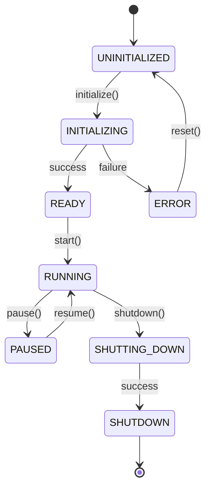
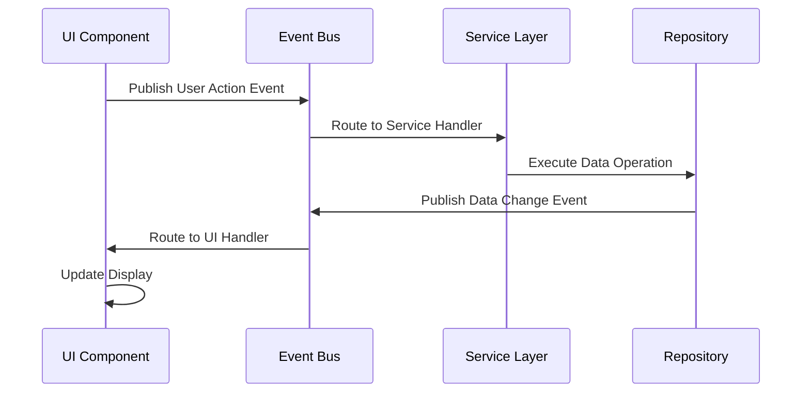
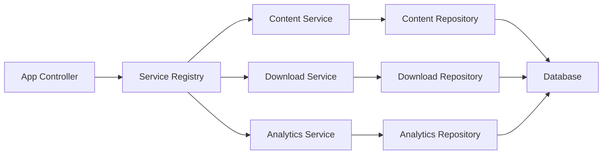
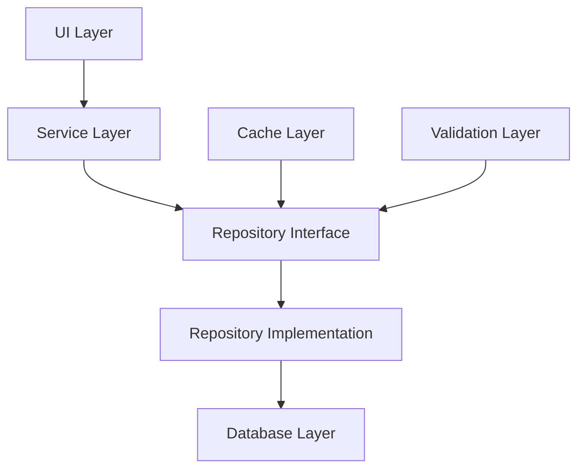
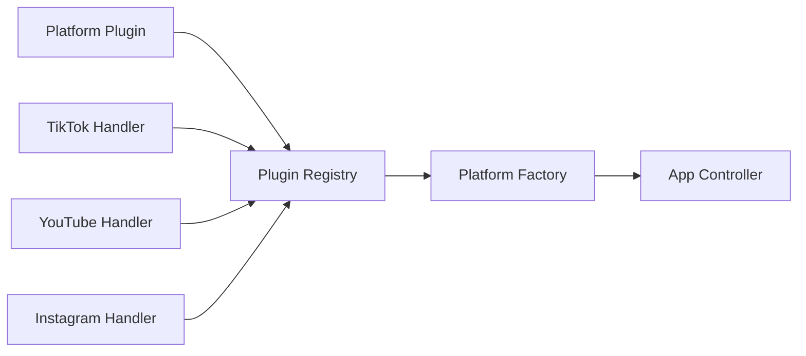

# Component-Level Details Documentation
## Social Download Manager v2.0

## Table of Contents
- [Core Components](#core-components)
- [Platform Components](#platform-components)
- [Data Layer Components](#data-layer-components)
- [UI Components](#ui-components)
- [Service Layer Components](#service-layer-components)
- [Integration Components](#integration-components)
- [Utility Components](#utility-components)
- [Component Interaction Patterns](#component-interaction-patterns)

## Core Components

### 1. App Controller (`core/app_controller.py`)

#### Overview
The App Controller serves as the central orchestrator for the entire application, implementing clean architecture principles and acting as the primary dependency injection container.

#### Responsibilities
- **Lifecycle Management**: Initialize, start, pause, resume, and shutdown application components
- **Dependency Injection**: Provide centralized service registry and component resolution
- **Event Coordination**: Orchestrate event flow between different application layers
- **Error Handling**: Coordinate global error handling and recovery strategies
- **Configuration Management**: Centralize access to application configuration

#### Interfaces
```python
class IAppController(ABC):
    @abstractmethod
    async def initialize(self) -> ControllerResult
    
    @abstractmethod
    async def start(self) -> ControllerResult
    
    @abstractmethod
    async def shutdown(self) -> ControllerResult
    
    @abstractmethod
    def get_service(self, service_type: Type[T]) -> T
    
    @abstractmethod
    def register_component(self, component: Any, component_id: str) -> bool
```

#### Dependencies
- **Event System**: For publishing lifecycle events
- **Config Manager**: For accessing application configuration
- **Service Registry**: For service management and resolution
- **Error Management**: For handling application-level errors

#### Key Methods
| Method | Description | Return Type |
|--------|-------------|-------------|
| `initialize()` | Initialize all application components | `ControllerResult` |
| `get_service()` | Retrieve registered service by type | Generic type `T` |
| `publish_event()` | Publish application-wide events | `bool` |
| `get_component_status()` | Check health of registered components | `ComponentStatus` |
| `handle_error()` | Process and route application errors | `ErrorResult` |

#### State Management


### 2. Event System (`core/event_system.py`)

#### Overview
Provides event-driven communication backbone using publisher/subscriber pattern with type safety and async support.

#### Responsibilities
- **Event Bus Management**: Central event routing and distribution
- **Type-Safe Events**: Strongly typed event system with validation
- **Async Event Handling**: Support for both sync and async event handlers
- **Event Filtering**: Advanced event filtering and routing rules
- **Event Persistence**: Optional event logging and replay capabilities

#### Interfaces
```python
class IEventBus(ABC):
    @abstractmethod
    def publish(self, event: Event) -> None
    
    @abstractmethod
    def subscribe(self, event_type: EventType, handler: EventHandler) -> str
    
    @abstractmethod
    def unsubscribe(self, subscription_id: str) -> bool
    
    @abstractmethod
    async def publish_async(self, event: Event) -> None
```

#### Event Types
| Event Type | Description | Payload |
|------------|-------------|---------|
| `UI_EVENT` | User interface interactions | `UIEventData` |
| `DOWNLOAD_EVENT` | Download progress and status | `DownloadEventData` |
| `PLATFORM_EVENT` | Platform-specific events | `PlatformEventData` |
| `ERROR_EVENT` | Error notifications | `ErrorEventData` |
| `ANALYTICS_EVENT` | Analytics and metrics | `AnalyticsEventData` |
| `SYSTEM_EVENT` | System lifecycle events | `SystemEventData` |

#### Dependencies
- **Threading Support**: For thread-safe event handling
- **Async Support**: For asynchronous event processing
- **Logging**: For event audit trails

### 3. Configuration Manager (`core/config_manager.py`)

#### Overview
Centralized configuration management with hierarchical configuration support and environment-specific overrides.

#### Responsibilities
- **Configuration Loading**: Load from multiple sources (files, environment, defaults)
- **Validation**: Validate configuration schemas and constraints
- **Hot Reload**: Support runtime configuration updates
- **Environment Management**: Environment-specific configuration handling
- **Secure Storage**: Secure handling of sensitive configuration data

#### Interfaces
```python
class IConfigManager(ABC):
    @abstractmethod
    def get_config(self, key: str) -> Any
    
    @abstractmethod
    def set_config(self, key: str, value: Any) -> bool
    
    @abstractmethod
    def load_from_file(self, file_path: str) -> bool
    
    @abstractmethod
    def validate_config(self) -> ValidationResult
```

#### Configuration Schema
```python
@dataclass
class AppConfig:
    app_name: str
    version: str
    debug: bool
    log_level: str
    
    database: DatabaseConfig
    ui: UIConfig
    download: DownloadConfig
    platforms: Dict[str, PlatformConfig]
```

#### Dependencies
- **File System**: For configuration file access
- **Validation**: For schema validation
- **Encryption**: For sensitive data handling

### 4. Service Registry (`core/services/`)

#### Overview
Dependency injection container and service lifecycle management system.

#### Responsibilities
- **Service Registration**: Register and manage service instances
- **Dependency Resolution**: Resolve service dependencies automatically
- **Singleton Management**: Manage singleton service instances
- **Service Discovery**: Locate services by interface or name
- **Health Monitoring**: Monitor service health and availability

#### Interfaces
```python
class IServiceRegistry(ABC):
    @abstractmethod
    def register_service(self, service: T, interface: Type[T]) -> bool
    
    @abstractmethod
    def get_service(self, interface: Type[T]) -> T
    
    @abstractmethod
    def resolve_dependencies(self, target: Any) -> Any
```

#### Service Types
- **IContentService**: Content management operations
- **IDownloadService**: Download orchestration and management
- **IAnalyticsService**: Analytics and reporting functionality
- **IPlatformService**: Platform-specific operations
- **INotificationService**: User notification management

## Platform Components

### 1. Platform Factory (`core/platform_factory.py`)

#### Overview
Factory pattern implementation for creating and managing platform handlers with plugin architecture support.

#### Responsibilities
- **Handler Registration**: Register platform handlers dynamically
- **Handler Creation**: Create platform handler instances
- **Capability Discovery**: Discover platform capabilities and features
- **Plugin Management**: Load and manage external platform plugins
- **Validation**: Validate platform handler implementations

#### Interfaces
```python
class IPlatformFactory(ABC):
    @abstractmethod
    def register_platform(self, handler_class: Type[IPlatformHandler]) -> bool
    
    @abstractmethod
    def create_handler(self, platform: PlatformType) -> IPlatformHandler
    
    @abstractmethod
    def get_supported_platforms(self) -> List[PlatformType]
```

#### Handler Registry
| Platform | Handler Class | Status | Capabilities |
|----------|---------------|--------|--------------|
| TikTok | `TikTokHandler` | Complete | Video, Audio, Metadata |
| YouTube | `YouTubeHandler` | Stub | Video, Playlist, Live |
| Instagram | `InstagramHandler` | Planned | Photo, Video, Story |
| Facebook | `FacebookHandler` | Planned | Video, Photo |

### 2. TikTok Handler (`platforms/tiktok/tiktok_handler.py`)

#### Overview
Comprehensive TikTok platform handler with advanced features and performance optimizations.

#### Responsibilities
- **URL Validation**: TikTok URL pattern validation and normalization
- **Video Extraction**: Video information and metadata extraction
- **Download Management**: Video download with quality selection
- **Error Handling**: TikTok-specific error handling and recovery
- **Caching**: Metadata and content caching for performance

#### Interfaces
```python
class TikTokHandler(IPlatformHandler):
    def get_platform_name(self) -> str
    def validate_url(self, url: str) -> ValidationResult
    async def get_video_info(self, url: str) -> VideoInfo
    async def download_video(self, video_info: VideoInfo, options: DownloadOptions) -> DownloadResult
```

#### Capabilities
| Feature | Status | Description |
|---------|--------|-------------|
| Video Download | ✅ Complete | Download videos without watermark |
| Audio Extraction | ✅ Complete | Extract audio tracks (MP3) |
| Quality Selection | ✅ Complete | Multiple quality options |
| Metadata Extraction | ✅ Complete | Creator, title, description, hashtags |
| Batch Downloads | ✅ Complete | Multiple video processing |
| Progress Tracking | ✅ Complete | Real-time download progress |

#### Dependencies
- **yt-dlp**: Core extraction engine
- **HTTP Client**: For API communications
- **Cache System**: For performance optimization
- **Error Handler**: For error management

### 3. YouTube Handler (`platforms/youtube/youtube_handler.py`)

#### Overview
YouTube platform handler with planned comprehensive feature set (currently stub implementation).

#### Planned Responsibilities
- **API Integration**: YouTube Data API integration
- **Video Extraction**: Video and metadata extraction
- **Playlist Support**: Playlist and channel processing
- **Live Stream**: Live stream download capabilities
- **Quota Management**: API quota monitoring and management

#### Current Implementation
```python
class YouTubeHandler(IPlatformHandler):
    def get_platform_name(self) -> str:
        return "YouTube"
    
    def validate_url(self, url: str) -> ValidationResult:
        # Stub implementation
        return ValidationResult(is_valid=False, message="YouTube support coming soon")
```

#### Planned Features
| Feature | Priority | Description |
|---------|----------|-------------|
| Video Download | High | Single video downloads |
| Playlist Support | High | Playlist processing |
| Channel Support | Medium | Channel video downloads |
| Live Stream | Medium | Live stream recording |
| Subtitles | Low | Subtitle extraction |

## Data Layer Components

### 1. Repository Pattern (`data/models/repositories.py`)

#### Overview
Implements repository pattern for clean data access abstraction with comprehensive CRUD operations.

#### Base Repository Interface
```python
class IRepository(Generic[T], ABC):
    @abstractmethod
    async def create(self, entity: T) -> T
    
    @abstractmethod
    async def get_by_id(self, entity_id: str) -> Optional[T]
    
    @abstractmethod
    async def update(self, entity: T) -> T
    
    @abstractmethod
    async def delete(self, entity_id: str) -> bool
    
    @abstractmethod
    async def list(self, filters: Dict[str, Any] = None) -> List[T]
```

#### Repository Implementations

##### Content Repository
**Purpose**: Manage video content metadata and information
**Entity**: `ContentModel`
**Key Operations**:
- `get_by_platform()`: Filter content by platform
- `search_content()`: Full-text search in content
- `get_by_status()`: Filter by download status
- `update_download_progress()`: Update download progress

##### Download Repository
**Purpose**: Manage download records and progress tracking
**Entity**: `DownloadModel`
**Key Operations**:
- `get_active_downloads()`: Get currently active downloads
- `update_progress()`: Update download progress
- `get_download_history()`: Get historical downloads
- `cleanup_completed()`: Clean up old download records

##### Session Repository
**Purpose**: Manage user sessions and application state
**Entity**: `SessionModel`
**Key Operations**:
- `get_current_session()`: Get active user session
- `save_preferences()`: Save user preferences
- `get_application_state()`: Get application state
- `update_last_activity()`: Update session activity

### 2. Database Manager (`data/database/`)

#### Overview
SQLite database management with migration system, connection pooling, and transaction support.

#### Components

##### Connection Manager
```python
class ConnectionManager:
    def get_connection(self) -> sqlite3.Connection
    def execute_query(self, query: str, params: tuple) -> Any
    def execute_transaction(self, operations: List[Operation]) -> bool
    def close_all_connections(self) -> None
```

##### Migration System
```python
class MigrationManager:
    def get_current_version(self) -> int
    def apply_migrations(self) -> MigrationResult
    def rollback_migration(self, target_version: int) -> MigrationResult
    def validate_schema(self) -> ValidationResult
```

#### Database Schema
```sql
-- Content table
CREATE TABLE content (
    id TEXT PRIMARY KEY,
    platform TEXT NOT NULL,
    url TEXT UNIQUE NOT NULL,
    title TEXT,
    creator TEXT,
    duration INTEGER,
    status TEXT DEFAULT 'pending',
    metadata JSON,
    created_at TIMESTAMP DEFAULT CURRENT_TIMESTAMP,
    updated_at TIMESTAMP DEFAULT CURRENT_TIMESTAMP
);

-- Download table
CREATE TABLE downloads (
    id TEXT PRIMARY KEY,
    content_id TEXT REFERENCES content(id),
    file_path TEXT,
    file_size INTEGER,
    progress REAL DEFAULT 0.0,
    status TEXT DEFAULT 'pending',
    download_start TIMESTAMP,
    download_end TIMESTAMP,
    error_message TEXT
);
```

### 3. Data Models (`data/models/`)

#### Overview
Pydantic-based data models with validation, serialization, and relationship management.

#### Core Models

##### ContentModel
```python
class ContentModel(BaseModel):
    id: str = Field(default_factory=lambda: str(uuid.uuid4()))
    platform: PlatformType
    url: HttpUrl
    title: Optional[str] = None
    creator: Optional[str] = None
    duration: Optional[int] = None
    status: ContentStatus = ContentStatus.PENDING
    metadata: Dict[str, Any] = Field(default_factory=dict)
    created_at: datetime = Field(default_factory=datetime.now)
    updated_at: datetime = Field(default_factory=datetime.now)
```

##### DownloadModel
```python
class DownloadModel(BaseModel):
    id: str = Field(default_factory=lambda: str(uuid.uuid4()))
    content_id: str
    file_path: Optional[Path] = None
    file_size: Optional[int] = None
    progress: float = 0.0
    status: DownloadStatus = DownloadStatus.PENDING
    download_start: Optional[datetime] = None
    download_end: Optional[datetime] = None
    error_message: Optional[str] = None
```

#### Model Features
- **Validation**: Automatic field validation with custom validators
- **Serialization**: JSON serialization with custom encoders
- **Relationships**: Model relationship management
- **Versioning**: Model versioning for schema evolution
- **Timestamps**: Automatic timestamp management

## UI Components

### 1. Component Architecture (`ui/components/`)

#### Overview
Modular UI component system with composition-based architecture, theme support, and accessibility features.

#### Base Components

##### BaseComponent
```python
class BaseComponent(QWidget):
    def __init__(self, config: ComponentConfig = None)
    def setup_ui(self) -> None
    def setup_events(self) -> None
    def update_theme(self, theme: Theme) -> None
    def update_language(self, language: str) -> None
```

##### Component Mixins
| Mixin | Purpose | Key Methods |
|-------|---------|-------------|
| `LanguageMixin` | Multi-language support | `tr()`, `update_language()` |
| `ThemeMixin` | Theme management | `apply_theme()`, `get_theme_value()` |
| `TooltipMixin` | Enhanced tooltips | `set_tooltip()`, `update_tooltip()` |
| `AccessibilityMixin` | Accessibility features | `set_accessible_name()`, `set_role()` |

### 2. Table Components (`ui/components/tables/`)

#### Overview
Advanced table components with sorting, filtering, selection, and real-time updates.

#### VideoTable Component
```python
class VideoTable(BaseTableComponent):
    def __init__(self, config: TableConfig)
    def set_data(self, data: List[Dict[str, Any]]) -> None
    def add_row(self, row_data: Dict[str, Any]) -> None
    def update_row(self, row_id: str, data: Dict[str, Any]) -> None
    def get_selected_rows(self) -> List[Dict[str, Any]]
    def apply_filter(self, filter_criteria: FilterCriteria) -> None
```

#### Features
- **Dynamic Columns**: Configurable column display
- **Real-time Updates**: Live data updates without full refresh
- **Multi-selection**: Bulk selection with keyboard shortcuts
- **Context Menus**: Right-click context menus
- **Export Support**: Data export to CSV, JSON
- **Accessibility**: Screen reader support, keyboard navigation

### 3. Widget Components (`ui/components/widgets/`)

#### Overview
Specialized widgets for specific application functionality.

#### Key Widgets

##### PlatformSelector
```python
class PlatformSelector(BaseWidget):
    platform_changed = pyqtSignal(str)
    
    def set_available_platforms(self, platforms: List[str]) -> None
    def set_selected_platform(self, platform: str) -> None
    def get_selected_platform(self) -> str
```

##### DownloadProgress
```python
class DownloadProgress(BaseWidget):
    def update_progress(self, progress: float) -> None
    def set_status(self, status: str) -> None
    def set_details(self, details: Dict[str, Any]) -> None
```

##### QualitySelector
```python
class QualitySelector(BaseWidget):
    quality_changed = pyqtSignal(str)
    
    def set_available_qualities(self, qualities: List[str]) -> None
    def set_selected_quality(self, quality: str) -> None
```

## Service Layer Components

### 1. Content Service (`core/services/content_service.py`)

#### Overview
Business logic for content management operations with validation and business rules enforcement.

#### Responsibilities
- **Content Validation**: Validate content URLs and metadata
- **Content Processing**: Process and normalize content information
- **Business Rules**: Enforce content-related business rules
- **Integration**: Coordinate with platform handlers and repositories

#### Interface
```python
class IContentService(ABC):
    @abstractmethod
    async def validate_content_url(self, url: str) -> ValidationResult
    
    @abstractmethod
    async def get_content_info(self, url: str) -> ContentDTO
    
    @abstractmethod
    async def save_content(self, content: ContentDTO) -> ContentDTO
    
    @abstractmethod
    async def search_content(self, criteria: SearchCriteria) -> List[ContentDTO]
```

### 2. Download Service (`core/services/download_service.py`)

#### Overview
Orchestrates download operations with queue management, progress tracking, and error handling.

#### Responsibilities
- **Download Orchestration**: Coordinate download operations
- **Queue Management**: Manage download queue and priorities
- **Progress Tracking**: Track and report download progress
- **Error Handling**: Handle download errors and retries
- **File Management**: Manage downloaded files and metadata

#### Interface
```python
class IDownloadService(ABC):
    @abstractmethod
    async def start_download(self, content: ContentDTO, options: DownloadOptions) -> DownloadResult
    
    @abstractmethod
    async def pause_download(self, download_id: str) -> bool
    
    @abstractmethod
    async def resume_download(self, download_id: str) -> bool
    
    @abstractmethod
    async def cancel_download(self, download_id: str) -> bool
    
    @abstractmethod
    async def get_download_status(self, download_id: str) -> DownloadStatus
```

### 3. Analytics Service (`core/services/analytics_service.py`)

#### Overview
Analytics and reporting functionality for download metrics, usage patterns, and performance analysis.

#### Responsibilities
- **Metrics Collection**: Collect application usage metrics
- **Report Generation**: Generate analytics reports
- **Performance Analysis**: Analyze application performance
- **Data Aggregation**: Aggregate data for insights
- **Export Functionality**: Export analytics data

#### Interface
```python
class IAnalyticsService(ABC):
    @abstractmethod
    async def track_event(self, event: AnalyticsEvent) -> None
    
    @abstractmethod
    async def generate_report(self, report_type: ReportType, filters: Dict[str, Any]) -> Report
    
    @abstractmethod
    async def get_metrics(self, metric_type: MetricType, time_range: TimeRange) -> MetricData
```

## Integration Components

### 1. Data Integration Layer (`core/data_integration/`)

#### Overview
Integration layer providing seamless data flow between UI components and data repositories.

#### Components

##### Repository Event Integration
```python
class RepositoryEventManager:
    def register_repository(self, repository: IRepository) -> None
    def setup_event_handlers(self) -> None
    def publish_data_change_event(self, event: DataChangeEvent) -> None
```

##### State Synchronization
```python
class StateSynchronizer:
    def sync_ui_state(self, component: UIComponent, data: Any) -> None
    def setup_bidirectional_sync(self, ui_component: UIComponent, repository: IRepository) -> None
```

##### Async Loading Patterns
```python
class AsyncDataLoader:
    async def load_data_async(self, loader_config: LoaderConfig) -> Any
    def setup_lazy_loading(self, component: UIComponent) -> None
    def setup_progressive_loading(self, component: UIComponent) -> None
```

### 2. Error Management Integration

#### Overview
Comprehensive error handling integration across all application components with the Task 19 error handling system.

#### Components

##### Global Error Handler
```python
class GlobalErrorHandler:
    def setup_error_boundaries(self) -> None
    def handle_unhandled_exception(self, exception: Exception) -> None
    def coordinate_error_recovery(self, error_info: ErrorInfo) -> RecoveryResult
```

##### Component Error Handlers
```python
class ComponentErrorHandler:
    def handle_ui_error(self, error: Exception, context: ErrorContext) -> bool
    def handle_platform_error(self, error: Exception, context: ErrorContext) -> bool
    def handle_download_error(self, error: Exception, context: ErrorContext) -> bool
```

## Component Interaction Patterns

### 1. Event-Driven Communication

#### Pattern Overview
Components communicate through events to maintain loose coupling and enable scalable architecture.

#### Event Flow


### 2. Dependency Injection Pattern

#### Pattern Overview
Services and components are injected through the service registry to enable testability and modularity.

#### Injection Flow


### 3. Repository Pattern Integration

#### Pattern Overview
Data access is abstracted through repository interfaces enabling clean separation between business logic and data access.

#### Data Flow


### 4. Plugin Architecture Pattern

#### Pattern Overview
Platform handlers are implemented as plugins enabling easy extension of platform support.

#### Plugin Registration


---

## Summary

This component-level documentation provides comprehensive details about each major component in Social Download Manager v2.0. The modular architecture enables:

- **Maintainability**: Clear separation of concerns and responsibilities
- **Testability**: Components can be tested in isolation
- **Extensibility**: New features and platforms can be added easily
- **Scalability**: Event-driven architecture supports concurrent operations
- **Reliability**: Comprehensive error handling across all components

Each component is designed to be self-contained while integrating seamlessly with the overall system architecture through well-defined interfaces and communication patterns.

---

*Generated by Task Master AI on 2025-06-01*
*Social Download Manager v2.0 Component Documentation* 