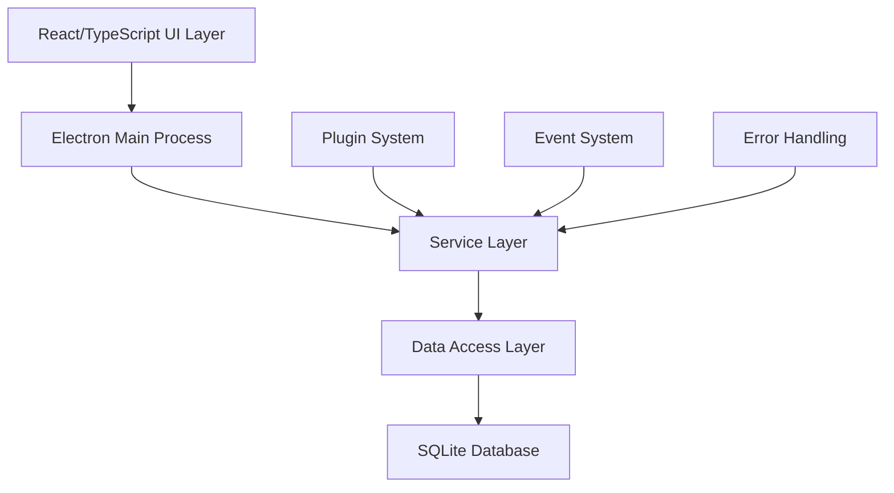
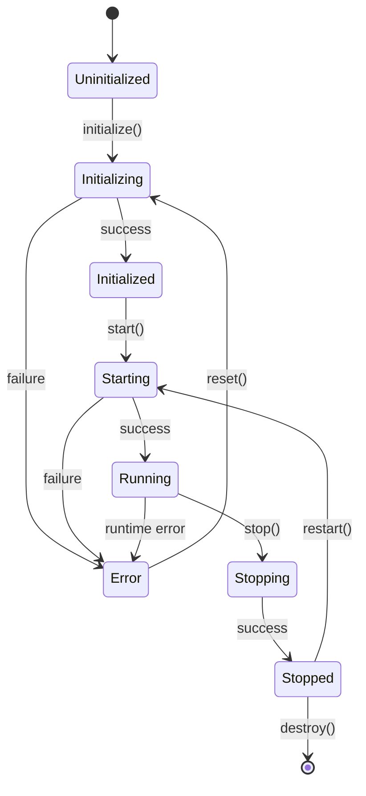
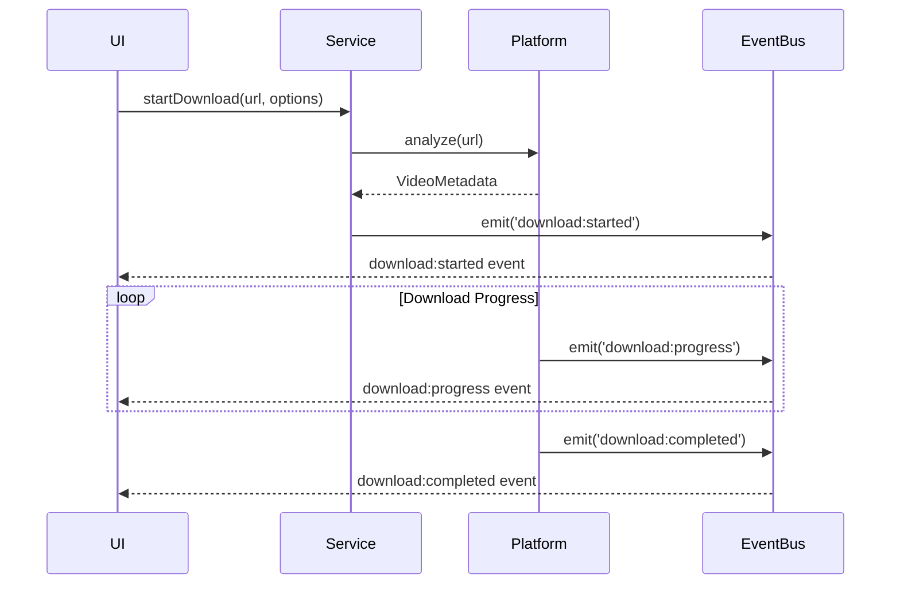
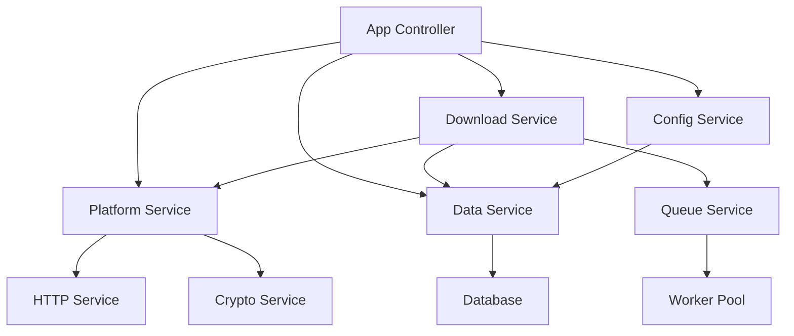
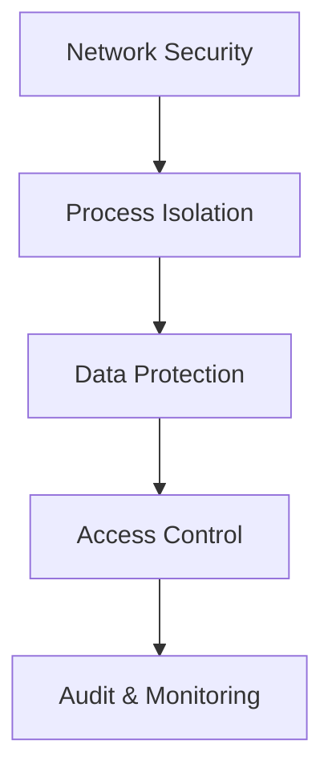

# Social Download Manager v2.0 - Developer Architecture Guide

## Technical Architecture Deep-Dive

This guide provides detailed technical information about Social Download Manager v2.0's architecture for developers who need to understand, extend, or contribute to the codebase.

## Table of Contents
- [Architecture Principles](#architecture-principles)
- [System Architecture](#system-architecture)
- [Component Architecture](#component-architecture)
- [Event System](#event-system)
- [Plugin Architecture](#plugin-architecture)
- [Data Layer](#data-layer)
- [Service Layer](#service-layer)
- [Error Handling System](#error-handling-system)
- [Security Architecture](#security-architecture)
- [Performance Patterns](#performance-patterns)

## Architecture Principles

### Core Design Principles

**1. Clean Architecture**
- Separation of concerns across layers
- Dependency inversion principle
- Independent of external agencies
- Testable architecture

**2. Event-Driven Architecture**
- Loose coupling between components
- Asynchronous communication
- Reactive programming patterns
- Message-driven interactions

**3. Modular Design**
- Plugin-based extensibility
- Service-oriented architecture
- Component composition
- Clear interfaces and contracts

**4. Error-First Design**
- Comprehensive error handling
- Graceful degradation
- Recovery mechanisms
- Detailed error reporting

### Technical Stack



## System Architecture

### Process Architecture

Social Download Manager uses Electron's multi-process architecture:

**Main Process**
- Application lifecycle management
- System integration (file system, OS APIs)
- Security enforcement
- Process communication coordination

**Renderer Process(es)**
- UI rendering (React application)
- User interaction handling
- IPC communication with main process
- Client-side state management

**Worker Processes**
- Download processing
- Video analysis
- File operations
- CPU-intensive tasks

### Inter-Process Communication

```typescript
// IPC Channel Definitions
interface IPCChannels {
  // Download management
  'download:start': (url: string, options: DownloadOptions) => Promise<DownloadId>;
  'download:pause': (id: DownloadId) => Promise<void>;
  'download:resume': (id: DownloadId) => Promise<void>;
  'download:cancel': (id: DownloadId) => Promise<void>;
  
  // Platform operations
  'platform:analyze': (url: string) => Promise<VideoMetadata>;
  'platform:getSupportedQualities': (url: string) => Promise<Quality[]>;
  
  // Data operations
  'data:getDownloadHistory': (filter?: HistoryFilter) => Promise<DownloadRecord[]>;
  'data:saveDownload': (record: DownloadRecord) => Promise<void>;
  
  // System operations
  'system:getStorageInfo': () => Promise<StorageInfo>;
  'system:openFolder': (path: string) => Promise<void>;
}
```

### Module Structure

```
src/
├── main/                    # Main process code
│   ├── app/                # Application lifecycle
│   ├── services/           # Core services
│   ├── workers/            # Worker processes
│   └── ipc/               # IPC handlers
├── renderer/               # Renderer process code
│   ├── components/         # React components
│   ├── hooks/             # React hooks
│   ├── stores/            # State management
│   └── utils/             # Utility functions
├── shared/                 # Shared code
│   ├── types/             # TypeScript definitions
│   ├── constants/         # Application constants
│   └── validators/        # Data validation
└── plugins/               # Plugin system
    ├── core/              # Core plugin framework
    ├── platforms/         # Platform-specific plugins
    └── integrations/      # External integrations
```

## Component Architecture

### Component Hierarchy

```typescript
// Core Component Interfaces
interface ComponentBase {
  id: string;
  name: string;
  version: string;
  dependencies: string[];
  
  initialize(): Promise<void>;
  destroy(): Promise<void>;
  getStatus(): ComponentStatus;
}

interface ServiceComponent extends ComponentBase {
  start(): Promise<void>;
  stop(): Promise<void>;
  restart(): Promise<void>;
}

interface PlatformComponent extends ComponentBase {
  platform: PlatformType;
  supports(url: string): boolean;
  analyze(url: string): Promise<VideoMetadata>;
  download(url: string, options: DownloadOptions): Promise<DownloadStream>;
}
```

### Component Lifecycle



### Service Registry

```typescript
class ServiceRegistry {
  private services = new Map<string, ServiceComponent>();
  private dependencies = new Map<string, string[]>();
  
  register<T extends ServiceComponent>(service: T): void {
    this.services.set(service.name, service);
    this.dependencies.set(service.name, service.dependencies);
  }
  
  async start(): Promise<void> {
    const startOrder = this.resolveDependencies();
    
    for (const serviceName of startOrder) {
      const service = this.services.get(serviceName);
      await service?.initialize();
      await service?.start();
    }
  }
  
  private resolveDependencies(): string[] {
    // Topological sort implementation
    // Returns services in dependency order
  }
}
```

## Event System

### Event Architecture

The event system uses a centralized event bus with typed events:

```typescript
// Event Type System
interface EventMap {
  // Download events
  'download:started': DownloadStartedEvent;
  'download:progress': DownloadProgressEvent;
  'download:completed': DownloadCompletedEvent;
  'download:failed': DownloadFailedEvent;
  
  // Platform events
  'platform:registered': PlatformRegisteredEvent;
  'platform:analyzed': PlatformAnalyzedEvent;
  
  // System events
  'system:startup': SystemStartupEvent;
  'system:shutdown': SystemShutdownEvent;
  'system:error': SystemErrorEvent;
}

// Event Bus Implementation
class EventBus {
  private listeners = new Map<keyof EventMap, Set<Function>>();
  
  on<K extends keyof EventMap>(
    event: K,
    listener: (data: EventMap[K]) => void
  ): void {
    if (!this.listeners.has(event)) {
      this.listeners.set(event, new Set());
    }
    this.listeners.get(event)!.add(listener);
  }
  
  emit<K extends keyof EventMap>(
    event: K,
    data: EventMap[K]
  ): void {
    const listeners = this.listeners.get(event);
    if (listeners) {
      listeners.forEach(listener => listener(data));
    }
  }
}
```

### Event Flow Patterns

**Download Event Flow**:


## Plugin Architecture

### Plugin System Design

```typescript
// Plugin Interface
interface Plugin {
  id: string;
  name: string;
  version: string;
  type: PluginType;
  
  initialize(context: PluginContext): Promise<void>;
  destroy(): Promise<void>;
}

// Platform Plugin
interface PlatformPlugin extends Plugin {
  type: 'platform';
  platform: PlatformType;
  
  supports(url: string): boolean;
  analyze(url: string): Promise<VideoMetadata>;
  download(url: string, options: DownloadOptions): AsyncIterable<DownloadChunk>;
}

// UI Plugin
interface UIPlugin extends Plugin {
  type: 'ui';
  component: React.ComponentType<any>;
  location: UILocation;
}

// Integration Plugin
interface IntegrationPlugin extends Plugin {
  type: 'integration';
  service: string;
  
  connect(credentials: any): Promise<void>;
  sync(data: any): Promise<void>;
}
```

### Plugin Context

```typescript
interface PluginContext {
  // Core services
  eventBus: EventBus;
  dataService: DataService;
  configService: ConfigService;
  
  // Platform services
  platformRegistry: PlatformRegistry;
  downloadManager: DownloadManager;
  
  // UI services (for UI plugins)
  componentRegistry?: ComponentRegistry;
  themeManager?: ThemeManager;
  
  // Utilities
  logger: Logger;
  storage: Storage;
  httpClient: HttpClient;
}
```

### Plugin Loading

```typescript
class PluginLoader {
  private plugins = new Map<string, Plugin>();
  private context: PluginContext;
  
  async loadPlugin(pluginPath: string): Promise<void> {
    // Load plugin manifest
    const manifest = await this.loadManifest(pluginPath);
    
    // Validate plugin
    this.validatePlugin(manifest);
    
    // Load plugin code
    const PluginClass = await import(path.join(pluginPath, manifest.entry));
    
    // Create plugin instance
    const plugin = new PluginClass.default();
    
    // Initialize plugin
    await plugin.initialize(this.context);
    
    // Register plugin
    this.plugins.set(plugin.id, plugin);
  }
}
```

## Data Layer

### Repository Pattern

```typescript
// Base Repository
abstract class BaseRepository<T, K> {
  protected db: Database;
  protected tableName: string;
  
  constructor(db: Database, tableName: string) {
    this.db = db;
    this.tableName = tableName;
  }
  
  abstract create(entity: Omit<T, 'id'>): Promise<T>;
  abstract findById(id: K): Promise<T | null>;
  abstract findAll(filter?: Partial<T>): Promise<T[]>;
  abstract update(id: K, updates: Partial<T>): Promise<T>;
  abstract delete(id: K): Promise<void>;
}

// Download Repository
class DownloadRepository extends BaseRepository<DownloadRecord, string> {
  async create(download: Omit<DownloadRecord, 'id'>): Promise<DownloadRecord> {
    const id = generateId();
    const record = { id, ...download, createdAt: new Date() };
    
    await this.db.run(
      `INSERT INTO ${this.tableName} (id, url, title, platform, status, createdAt) 
       VALUES (?, ?, ?, ?, ?, ?)`,
      [record.id, record.url, record.title, record.platform, record.status, record.createdAt]
    );
    
    return record;
  }
  
  async findByStatus(status: DownloadStatus): Promise<DownloadRecord[]> {
    return this.db.all(
      `SELECT * FROM ${this.tableName} WHERE status = ?`,
      [status]
    );
  }
}
```

### Database Schema

```sql
-- Downloads table
CREATE TABLE downloads (
  id TEXT PRIMARY KEY,
  url TEXT NOT NULL,
  title TEXT,
  description TEXT,
  platform TEXT NOT NULL,
  creator TEXT,
  duration INTEGER,
  file_size INTEGER,
  file_path TEXT,
  thumbnail_path TEXT,
  quality TEXT,
  format TEXT,
  status TEXT NOT NULL DEFAULT 'pending',
  progress REAL DEFAULT 0,
  error_message TEXT,
  metadata TEXT, -- JSON
  created_at DATETIME DEFAULT CURRENT_TIMESTAMP,
  updated_at DATETIME DEFAULT CURRENT_TIMESTAMP,
  completed_at DATETIME
);

-- Configuration table
CREATE TABLE config (
  key TEXT PRIMARY KEY,
  value TEXT NOT NULL,
  type TEXT NOT NULL DEFAULT 'string',
  updated_at DATETIME DEFAULT CURRENT_TIMESTAMP
);

-- Platforms table
CREATE TABLE platforms (
  id TEXT PRIMARY KEY,
  name TEXT NOT NULL,
  enabled BOOLEAN DEFAULT true,
  config TEXT, -- JSON
  last_updated DATETIME DEFAULT CURRENT_TIMESTAMP
);
```

### Data Access Layer

```typescript
class DataService {
  private repositories: Map<string, BaseRepository<any, any>>;
  
  constructor(private db: Database) {
    this.repositories = new Map([
      ['downloads', new DownloadRepository(db, 'downloads')],
      ['config', new ConfigRepository(db, 'config')],
      ['platforms', new PlatformRepository(db, 'platforms')]
    ]);
  }
  
  getRepository<T>(name: string): T {
    const repo = this.repositories.get(name);
    if (!repo) {
      throw new Error(`Repository ${name} not found`);
    }
    return repo as T;
  }
  
  async transaction<T>(callback: (tx: Transaction) => Promise<T>): Promise<T> {
    return this.db.transaction(callback);
  }
}
```

## Service Layer

### Service Architecture

```typescript
// Base Service
abstract class BaseService {
  protected eventBus: EventBus;
  protected logger: Logger;
  protected config: ConfigService;
  
  constructor(
    eventBus: EventBus,
    logger: Logger,
    config: ConfigService
  ) {
    this.eventBus = eventBus;
    this.logger = logger;
    this.config = config;
  }
  
  abstract initialize(): Promise<void>;
  abstract destroy(): Promise<void>;
}

// Download Service
class DownloadService extends BaseService {
  private activeDownloads = new Map<string, DownloadProcess>();
  private downloadQueue = new Queue<DownloadRequest>();
  
  async startDownload(
    url: string,
    options: DownloadOptions
  ): Promise<string> {
    // Validate URL
    const platform = this.platformRegistry.getPlatformForUrl(url);
    if (!platform) {
      throw new Error('Unsupported platform');
    }
    
    // Analyze video
    const metadata = await platform.analyze(url);
    
    // Create download record
    const download = await this.dataService
      .getRepository<DownloadRepository>('downloads')
      .create({
        url,
        title: metadata.title,
        platform: platform.platform,
        status: 'queued'
      });
    
    // Add to queue
    this.downloadQueue.enqueue({
      id: download.id,
      url,
      options,
      metadata
    });
    
    // Emit event
    this.eventBus.emit('download:started', {
      id: download.id,
      url,
      metadata
    });
    
    return download.id;
  }
}
```

### Service Dependencies



## Error Handling System

### Error Categories

The v2.0 error handling system categorizes errors into 11 main types:

```typescript
enum ErrorCategory {
  NETWORK = 'network',
  PLATFORM = 'platform',
  FILE_SYSTEM = 'file_system',
  AUTHENTICATION = 'authentication',
  VALIDATION = 'validation',
  RATE_LIMIT = 'rate_limit',
  PERMISSION = 'permission',
  STORAGE = 'storage',
  PARSING = 'parsing',
  TIMEOUT = 'timeout',
  UNKNOWN = 'unknown'
}

interface ErrorContext {
  category: ErrorCategory;
  severity: 'low' | 'medium' | 'high' | 'critical';
  recoverable: boolean;
  retryable: boolean;
  userAction?: string;
  technicalDetails?: any;
}
```

### Error Recovery Strategies

```typescript
class ErrorRecoveryManager {
  private strategies = new Map<ErrorCategory, RecoveryStrategy[]>();
  
  constructor() {
    this.registerStrategies();
  }
  
  async recover(error: CategorizedError): Promise<RecoveryResult> {
    const strategies = this.strategies.get(error.category) || [];
    
    for (const strategy of strategies) {
      if (strategy.canHandle(error)) {
        try {
          const result = await strategy.execute(error);
          if (result.success) {
            return result;
          }
        } catch (recoveryError) {
          // Log recovery failure but continue with next strategy
          this.logger.warn('Recovery strategy failed', { strategy, recoveryError });
        }
      }
    }
    
    // All recovery strategies failed
    return { success: false, error };
  }
  
  private registerStrategies(): void {
    // Network error strategies
    this.strategies.set(ErrorCategory.NETWORK, [
      new RetryWithBackoffStrategy(),
      new ChangeServerStrategy(),
      new UseProxyStrategy()
    ]);
    
    // Platform error strategies
    this.strategies.set(ErrorCategory.PLATFORM, [
      new RefreshTokenStrategy(),
      new AlternativeEndpointStrategy(),
      new QualityDowngradeStrategy()
    ]);
    
    // File system error strategies
    this.strategies.set(ErrorCategory.FILE_SYSTEM, [
      new ChangeLocationStrategy(),
      new CreateDirectoryStrategy(),
      new CleanupSpaceStrategy()
    ]);
  }
}
```

### Error Propagation

```typescript
// Error event flow
interface ErrorEvent {
  id: string;
  timestamp: Date;
  error: CategorizedError;
  context: ErrorContext;
  recovery?: RecoveryResult;
}

// Error handling middleware
class ErrorMiddleware {
  async handle(
    error: Error,
    context: any,
    next: Function
  ): Promise<void> {
    // Categorize error
    const categorizedError = this.categorizeError(error, context);
    
    // Attempt recovery
    const recoveryResult = await this.recoveryManager.recover(categorizedError);
    
    // Emit error event
    this.eventBus.emit('system:error', {
      id: generateId(),
      timestamp: new Date(),
      error: categorizedError,
      context,
      recovery: recoveryResult
    });
    
    // If not recovered, propagate error
    if (!recoveryResult.success) {
      throw categorizedError;
    }
  }
}
```

## Security Architecture

### Security Layers



### Content Security Policy

```typescript
// CSP Configuration
const CSP_POLICY = {
  'default-src': ["'self'"],
  'script-src': ["'self'", "'unsafe-inline'", "blob:"],
  'style-src': ["'self'", "'unsafe-inline'"],
  'img-src': ["'self'", "data:", "blob:", "https:"],
  'media-src': ["'self'", "blob:"],
  'connect-src': ["'self'", "https:", "wss:"],
  'font-src': ["'self'"],
  'object-src': ["'none'"],
  'frame-src': ["'none'"]
};
```

### Data Sanitization

```typescript
class DataSanitizer {
  static sanitizeFilename(filename: string): string {
    return filename
      .replace(/[<>:"/\\|?*]/g, '_')
      .replace(/\s+/g, ' ')
      .trim()
      .substring(0, 255);
  }
  
  static sanitizeUrl(url: string): string {
    try {
      const parsed = new URL(url);
      return parsed.toString();
    } catch {
      throw new ValidationError('Invalid URL format');
    }
  }
  
  static sanitizeUserInput(input: string): string {
    return input
      .replace(/[<>&"']/g, char => ({
        '<': '&lt;',
        '>': '&gt;',
        '&': '&amp;',
        '"': '&quot;',
        "'": '&#x27;'
      }[char] || char));
  }
}
```

## Performance Patterns

### Concurrency Management

```typescript
class ConcurrencyManager {
  private semaphore: Semaphore;
  private activeOperations = new Set<string>();
  
  constructor(maxConcurrency: number) {
    this.semaphore = new Semaphore(maxConcurrency);
  }
  
  async execute<T>(
    operation: () => Promise<T>,
    operationId: string
  ): Promise<T> {
    await this.semaphore.acquire();
    this.activeOperations.add(operationId);
    
    try {
      return await operation();
    } finally {
      this.activeOperations.delete(operationId);
      this.semaphore.release();
    }
  }
  
  getActiveOperationCount(): number {
    return this.activeOperations.size;
  }
}
```

### Memory Management

```typescript
class MemoryManager {
  private caches = new Map<string, Cache<any, any>>();
  private memoryThreshold = 1024 * 1024 * 100; // 100MB
  
  createCache<K, V>(
    name: string,
    options: CacheOptions
  ): Cache<K, V> {
    const cache = new LRUCache<K, V>(options);
    this.caches.set(name, cache);
    return cache;
  }
  
  async checkMemoryUsage(): Promise<void> {
    const usage = process.memoryUsage();
    
    if (usage.heapUsed > this.memoryThreshold) {
      // Trigger garbage collection
      global.gc?.();
      
      // Clear least important caches
      await this.clearLowPriorityCaches();
      
      // Emit warning
      this.eventBus.emit('system:memory-warning', { usage });
    }
  }
  
  private async clearLowPriorityCaches(): Promise<void> {
    // Clear caches in order of priority
    const lowPriorityCaches = ['thumbnails', 'metadata', 'temporary'];
    
    for (const cacheName of lowPriorityCaches) {
      const cache = this.caches.get(cacheName);
      cache?.clear();
    }
  }
}
```

---

*Developer Architecture Guide for Social Download Manager v2.0*
*Last updated: June 2025* 