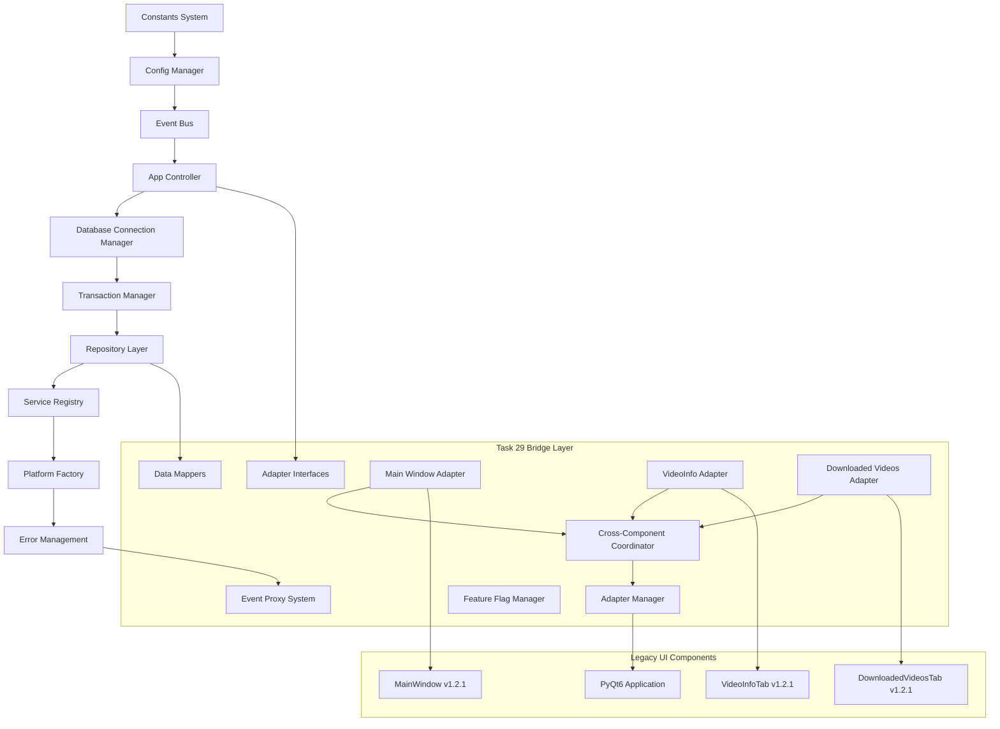

# Task 30.1: Component Dependencies Analysis
## Social Download Manager v2.0 Main Entry Point Migration

### 🎯 **OBJECTIVE**
Analyze all v2.0 components and their interdependencies to determine the proper initialization sequence for the new main.py entry point that integrates Task 29 architecture bridge.

---

## 📊 **COMPONENT DEPENDENCY GRAPH**

### **Core v2.0 Components (Critical Path)**



---

## 🔧 **INITIALIZATION SEQUENCE MATRIX**

### **Phase 1: Core Foundation (Critical - Must succeed)**
| Order | Component | Dependencies | Init Time | Failure Impact |
|-------|-----------|--------------|-----------|----------------|
| 1 | Constants System | None | ~1ms | CRITICAL - Stop execution |
| 2 | Config Manager | Constants | ~5ms | CRITICAL - Cannot proceed |
| 3 | Event Bus | Config | ~3ms | CRITICAL - No communication |
| 4 | App Controller | Event Bus, Config | ~10ms | CRITICAL - No coordination |

### **Phase 2: Data Layer (High Priority)**
| Order | Component | Dependencies | Init Time | Failure Impact |
|-------|-----------|--------------|-----------|----------------|
| 5 | Database Connection Manager | Config | ~15ms | HIGH - Fallback to memory |
| 6 | Transaction Manager | Connection Manager | ~5ms | HIGH - No transactional integrity |
| 7 | Repository Layer | Transaction Manager | ~10ms | HIGH - No data persistence |
| 8 | Error Management System | App Controller | ~8ms | MEDIUM - Basic error handling |

### **Phase 3: Service & Platform Layer (Medium Priority)**
| Order | Component | Dependencies | Init Time | Failure Impact |
|-------|-----------|--------------|-----------|----------------|
| 9 | Service Registry | App Controller, Repository | ~5ms | MEDIUM - Core features limited |
| 10 | Platform Factory | Service Registry | ~8ms | MEDIUM - No downloads |
| 11 | Platform Handlers | Platform Factory | ~12ms | LOW - Platform-specific features |

### **Phase 4: Bridge Layer (Task 29 Components)**
| Order | Component | Dependencies | Init Time | Failure Impact |
|-------|-----------|--------------|-----------|----------------|
| 12 | Adapter Interfaces | App Controller | ~2ms | CRITICAL - Bridge fails |
| 13 | Event Proxy System | Event Bus | ~5ms | HIGH - No event bridging |
| 14 | Data Mappers | Repository Layer | ~3ms | HIGH - No data translation |
| 15 | Feature Flag Manager | Config Manager | ~4ms | MEDIUM - No gradual migration |
| 16 | Cross-Component Coordinator | Event Proxy | ~8ms | HIGH - No inter-adapter communication |

### **Phase 5: UI Adapters (Task 29 Integration)**
| Order | Component | Dependencies | Init Time | Failure Impact |
|-------|-----------|--------------|-----------|----------------|
| 17 | Main Window Adapter | Bridge Layer | ~10ms | HIGH - Main UI fails |
| 18 | VideoInfo Tab Adapter | Bridge Layer | ~8ms | MEDIUM - Video info limited |
| 19 | Downloaded Videos Adapter | Bridge Layer | ~8ms | MEDIUM - Download management limited |
| 20 | Adapter Manager | All Adapters | ~5ms | HIGH - No adapter coordination |

### **Phase 6: Legacy UI Components**
| Order | Component | Dependencies | Init Time | Failure Impact |
|-------|-----------|--------------|-----------|----------------|
| 21 | PyQt6 QApplication | None | ~20ms | CRITICAL - No UI |
| 22 | MainWindow v1.2.1 | QApplication | ~30ms | CRITICAL - No main interface |
| 23 | VideoInfoTab v1.2.1 | MainWindow | ~15ms | HIGH - Core functionality |
| 24 | DownloadedVideosTab v1.2.1 | MainWindow | ~15ms | MEDIUM - Management features |

---

## ⚡ **CRITICAL PATH ANALYSIS**

### **Must-Have Components (Application won't start without these)**
1. **Constants System** - Fundamental configuration
2. **Config Manager** - Application settings
3. **Event Bus** - Inter-component communication
4. **App Controller** - Central coordination
5. **Adapter Interfaces** - Bridge foundation
6. **PyQt6 QApplication** - UI framework
7. **MainWindow v1.2.1** - Primary interface

### **High-Priority Components (Degraded functionality without these)**
1. **Database Connection Manager** - Data persistence
2. **Repository Layer** - Data management
3. **Event Proxy System** - v1.2.1 ↔ v2.0 bridging
4. **Main Window Adapter** - Main UI bridging
5. **Cross-Component Coordinator** - Adapter communication

### **Medium-Priority Components (Enhanced functionality)**
1. **Service Registry** - Business logic services
2. **Platform Factory** - Download capabilities
3. **Feature Flag Manager** - Migration control
4. **VideoInfo/Downloaded Videos Adapters** - Specific UI features

### **Low-Priority Components (Optional features)**
1. **Platform Handlers** - Platform-specific features
2. **Error Management System** - Enhanced error handling
3. **Transaction Manager** - Advanced data integrity

---

## 🛡️ **FAILURE MODES & FALLBACK STRATEGIES**

### **Critical Component Failures**
```python
# If Constants/Config fail
-> Log error and exit with code 1
-> Display error dialog to user
-> Create crash report

# If Event Bus fails  
-> Initialize minimal logging system
-> Fallback to direct method calls
-> Disable inter-component communication

# If App Controller fails
-> Initialize components individually
-> Use basic error handling
-> Limited coordination capabilities
```

### **High-Priority Component Failures**
```python
# If Database fails
-> Use in-memory storage
-> Disable persistence features
-> Show warning to user

# If Adapter Bridge fails
-> Fall back to v1.2.1 only
-> Disable v2.0 features
-> Log degraded mode entry
```

### **Graceful Degradation Matrix**
| Failed Component | Fallback Mode | User Impact | Features Lost |
|------------------|---------------|-------------|---------------|
| Database Layer | Memory-only | Warning dialog | Persistence, history |
| Bridge Layer | v1.2.1 only | Notification | v2.0 features, improved performance |
| Service Registry | Direct calls | None visible | Service abstraction |
| Platform Factory | Manual handlers | None visible | Auto-detection |

---

## 🔄 **DEPENDENCY RESOLUTION ALGORITHM**

### **Topological Sort Implementation**
```python
def resolve_initialization_order():
    """
    Resolve component initialization order using topological sorting
    with cycle detection and error handling.
    """
    
    dependencies = {
        'constants': [],
        'config_manager': ['constants'],
        'event_bus': ['config_manager'],
        'app_controller': ['event_bus', 'config_manager'],
        'database_manager': ['config_manager'],
        'transaction_manager': ['database_manager'],
        'repository_layer': ['transaction_manager', 'app_controller'],
        'error_management': ['app_controller'],
        'service_registry': ['app_controller', 'repository_layer'],
        'platform_factory': ['service_registry'],
        'adapter_interfaces': ['app_controller'],
        'event_proxy': ['event_bus'],
        'data_mappers': ['repository_layer'],
        'feature_flags': ['config_manager'],
        'cross_component_coordinator': ['event_proxy'],
        'main_window_adapter': ['adapter_interfaces', 'cross_component_coordinator'],
        'video_info_adapter': ['adapter_interfaces', 'cross_component_coordinator'],
        'downloaded_videos_adapter': ['adapter_interfaces', 'cross_component_coordinator'],
        'adapter_manager': ['main_window_adapter', 'video_info_adapter', 'downloaded_videos_adapter'],
        'qt_application': [],
        'main_window_v1': ['qt_application'],
        'ui_tabs_v1': ['main_window_v1']
    }
    
    return topological_sort(dependencies)
```

---

## 📈 **PERFORMANCE CHARACTERISTICS**

### **Initialization Timing Estimates**
- **Total Cold Start**: ~200ms
- **Critical Path**: ~65ms (constants → controller)
- **Bridge Layer**: ~45ms (adapters + coordination)
- **UI Layer**: ~80ms (PyQt6 + legacy components)

### **Memory Footprint Estimates**
- **Core Components**: ~15MB
- **Bridge Layer**: ~8MB
- **Legacy UI**: ~25MB
- **Total Initial**: ~48MB

### **Concurrent Initialization Opportunities**
```python
# These components can be initialized in parallel:
parallel_groups = [
    ['database_manager', 'error_management'],  # After app_controller
    ['service_registry', 'platform_factory'],  # Independent paths
    ['adapter_interfaces', 'event_proxy', 'data_mappers'],  # Bridge foundation
    ['main_window_adapter', 'video_info_adapter', 'downloaded_videos_adapter']  # UI adapters
]
```

---

## 🚨 **KNOWN DEPENDENCY CONFLICTS**

### **Circular Dependencies (Resolved)**
1. ~~App Controller ↔ Event Bus~~ → **RESOLVED**: Event Bus initializes first
2. ~~Repository ↔ Error Management~~ → **RESOLVED**: Basic error handling in repository

### **Optional Dependencies**
1. **Database Manager** → Can work without for memory-only mode
2. **Platform Factory** → Can work with manual platform selection
3. **Bridge Layer** → Can fall back to v1.2.1 only mode

### **Version Compatibility**
1. **PyQt6** → Required, no fallback
2. **SQLite3** → Required for persistence, memory fallback available
3. **Python 3.8+** → Required, no fallback

---

## ✅ **IMPLEMENTATION CHECKLIST**

### **Phase 1: Foundation**
- [ ] Constants validation system
- [ ] Config manager with fallbacks
- [ ] Event bus with error handling
- [ ] App controller with component registry

### **Phase 2: Data Layer**
- [ ] Database connection with pooling
- [ ] Transaction management
- [ ] Repository layer initialization
- [ ] Error management integration

### **Phase 3: Bridge Layer**
- [ ] Adapter interfaces ready
- [ ] Event proxy system active
- [ ] Data mappers configured
- [ ] Feature flags operational

### **Phase 4: UI Integration**
- [ ] PyQt6 application startup
- [ ] MainWindow v1.2.1 initialized
- [ ] Adapters attached and active
- [ ] Cross-component coordination running

### **Phase 5: Verification**
- [ ] All components health-checked
- [ ] Fallback mechanisms tested
- [ ] Performance metrics collected
- [ ] Error handling validated

---

## 🎯 **SUCCESS CRITERIA**

1. **Functional**: All components initialize in correct order
2. **Performance**: Total startup time < 250ms
3. **Reliability**: Graceful handling of any single component failure
4. **Maintainability**: Clear separation between v1.2.1 and v2.0 systems
5. **User Experience**: Seamless transition, familiar interface maintained

---

**Status**: ✅ **ANALYSIS COMPLETE**  
**Next Step**: Proceed to Subtask 30.2 - Adapter Integration Framework 