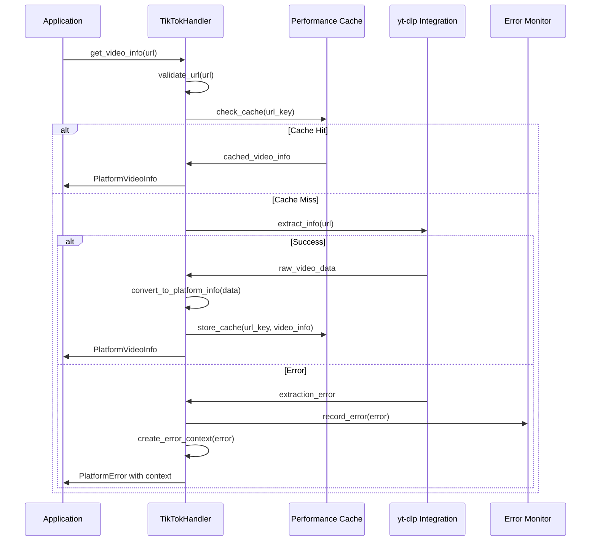
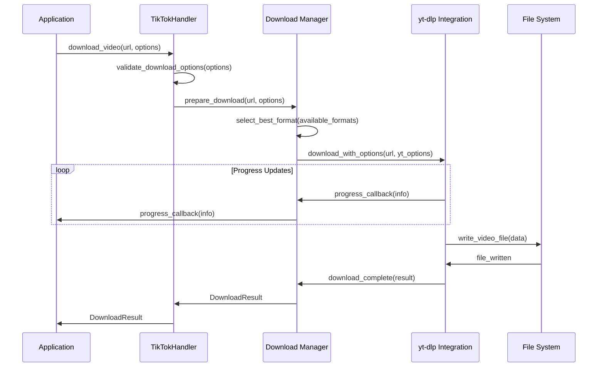
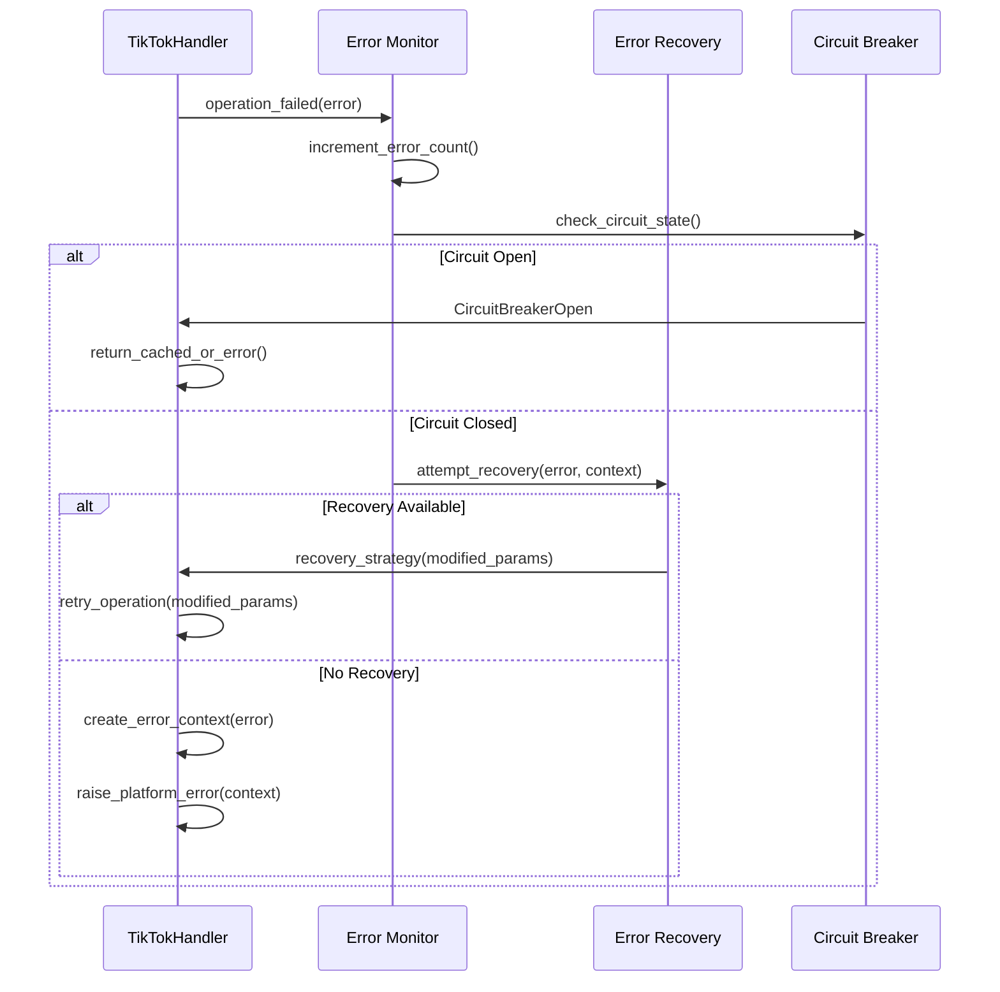

# TikTok Handler Architecture Documentation

This document provides a comprehensive overview of the TikTok platform handler architecture, design decisions, component interactions, and implementation details.

## Table of Contents

- [Architecture Overview](#architecture-overview)
- [Core Components](#core-components)
- [Design Decisions](#design-decisions)
- [Component Interactions](#component-interactions)
- [Performance Architecture](#performance-architecture)
- [Caching Strategy](#caching-strategy)
- [Error Handling Architecture](#error-handling-architecture)
- [Concurrency Model](#concurrency-model)
- [Extension Points](#extension-points)

## Architecture Overview

The TikTok handler follows a layered architecture that promotes separation of concerns, testability, and extensibility. The architecture is designed to handle the complexities of TikTok content extraction while providing a consistent interface for the broader platform system.

### High-Level Architecture

```
┌─────────────────────────────────────────────────────────────┐
│                    Platform Factory                          │
│                   (core.services)                           │
└─────────────────────┬───────────────────────────────────────┘
                      │
┌─────────────────────▼───────────────────────────────────────┐
│                TikTok Handler                               │
│            (AbstractPlatformHandler)                       │
├─────────────────────────────────────────────────────────────┤
│  ┌─────────────────┐  ┌─────────────────┐  ┌─────────────┐ │
│  │   URL Validation │  │ Video Info      │  │  Download   │ │
│  │      Module      │  │   Extraction    │  │   Manager   │ │
│  └─────────────────┘  └─────────────────┘  └─────────────┘ │
│                                                             │
│  ┌─────────────────┐  ┌─────────────────┐  ┌─────────────┐ │
│  │  Authentication │  │ Error Handling  │  │ Performance │ │
│  │    Manager       │  │    System       │  │  Monitor    │ │
│  └─────────────────┘  └─────────────────┘  └─────────────┘ │
└─────────────────────┬───────────────────────────────────────┘
                      │
┌─────────────────────▼───────────────────────────────────────┐
│              Enhanced Handler (Optional)                    │
│         (Performance Optimized Extension)                   │
├─────────────────────────────────────────────────────────────┤
│  ┌─────────────────┐  ┌─────────────────┐  ┌─────────────┐ │
│  │  Cache System   │  │  Task Pool      │  │ Connection  │ │
│  │                 │  │   Manager       │  │    Pool     │ │
│  └─────────────────┘  └─────────────────┘  └─────────────┘ │
└─────────────────────┬───────────────────────────────────────┘
                      │
┌─────────────────────▼───────────────────────────────────────┐
│                   yt-dlp Integration                        │
│            (External Content Extraction)                    │
└─────────────────────────────────────────────────────────────┘
```

## Core Components

### 1. TikTokHandler (Primary Interface)

**Location**: `platforms/tiktok/tiktok_handler.py`

**Responsibilities**:
- Implementation of `AbstractPlatformHandler` interface
- URL validation and pattern matching
- Video information extraction coordination
- Download orchestration
- Error handling and recovery

**Key Methods**:
```python
class TikTokHandler(AbstractPlatformHandler):
    def get_capabilities() -> PlatformCapabilities
    def is_valid_url(url: str) -> bool
    async def get_video_info(url: str) -> PlatformVideoInfo
    async def download_video(url: str, options: dict) -> DownloadResult
```

### 2. Enhanced Handler (Performance Layer)

**Location**: `platforms/tiktok/enhanced_handler.py`

**Responsibilities**:
- Performance optimization through caching
- Concurrent operation management
- Advanced connection pooling
- Performance monitoring and statistics

**Key Features**:
- Multi-level caching system
- Async task pool management
- Memory optimization
- Performance analytics

### 3. Performance Optimization Module

**Location**: `platforms/tiktok/performance_optimizations.py`

**Components**:
- `TikTokPerformanceCache`: TTL-based caching with LRU eviction
- `PerformanceMonitor`: Real-time performance tracking
- `AsyncTaskPool`: Concurrent task execution management
- `ConnectionPool`: HTTP connection optimization
- `MemoryOptimizedProcessor`: Memory-efficient data processing

### 4. Error Handling System

**Integrated within handler classes**

**Components**:
- `TikTokErrorContext`: Rich error context information
- `TikTokErrorMonitor`: Error rate tracking and circuit breaker
- `TikTokErrorRecovery`: Recovery strategy implementation
- Platform-specific exception mapping

## Design Decisions

### 1. Async-First Architecture

**Decision**: Built on async/await patterns throughout the codebase.

**Rationale**:
- Enables efficient I/O handling for network operations
- Supports concurrent video processing
- Provides better resource utilization
- Aligns with modern Python best practices

**Impact**:
- All public methods are async
- Internal operations use async patterns
- Integration requires async context

### 2. Composition Over Inheritance

**Decision**: Favor composition and dependency injection over deep inheritance.

**Rationale**:
- Improves testability through dependency injection
- Enables flexible configuration
- Reduces coupling between components
- Facilitates performance optimizations

**Implementation**:
```python
class TikTokHandler:
    def __init__(self, config: Optional[Dict] = None):
        self.config = config or {}
        self.session_state = self._create_session_state()
        self.error_monitor = self._create_error_monitor()
        # Composition of components
```

### 3. Platform-Agnostic Interface

**Decision**: Implement standardized `AbstractPlatformHandler` interface.

**Rationale**:
- Ensures consistency across platform handlers
- Enables polymorphic usage through platform factory
- Simplifies testing and mocking
- Facilitates future platform additions

**Interface**:
```python
@abstractmethod
async def get_video_info(self, url: str) -> PlatformVideoInfo:
    """Extract video information from URL"""
    
@abstractmethod  
async def download_video(self, url: str, options: dict) -> DownloadResult:
    """Download video with specified options"""
```

### 4. Layered Error Handling

**Decision**: Multi-layer error handling with context preservation.

**Rationale**:
- Provides meaningful error messages to users
- Enables sophisticated error recovery
- Supports debugging and monitoring
- Allows graceful degradation

**Architecture**:
```
Application Layer → Platform Layer → Integration Layer → External Service
      ↓                  ↓               ↓                    ↓
User-friendly      Context-aware    Technical errors    Raw exceptions
  messages          exceptions      with recovery         from yt-dlp
```

### 5. Performance-First Caching

**Decision**: Multi-level caching with intelligent cache key generation.

**Rationale**:
- Reduces redundant API calls
- Improves response times
- Minimizes rate limiting impact
- Enables offline operation for cached content

**Cache Levels**:
1. Video information cache (30-minute TTL)
2. Format selection cache (1-hour TTL)
3. Metadata extraction cache (30-minute TTL)
4. Upload date parsing cache (24-hour TTL)

### 6. Extensible Configuration

**Decision**: Hierarchical configuration system with environment override.

**Rationale**:
- Supports different deployment environments
- Enables performance tuning
- Allows feature toggling
- Facilitates testing configurations

**Configuration Hierarchy**:
```
Environment Variables → Config Dict → Default Values
```

## Component Interactions

### 1. Video Information Flow



### 2. Download Process Flow



### 3. Error Handling Flow



## Performance Architecture

### 1. Caching Architecture

The caching system uses a multi-layered approach with different TTL values based on data volatility:

```python
class CacheStrategy:
    VIDEO_INFO_TTL = 1800      # 30 minutes - moderate volatility
    FORMAT_SELECTION_TTL = 3600 # 1 hour - low volatility
    METADATA_TTL = 1800        # 30 minutes - moderate volatility
    UPLOAD_DATE_TTL = 86400    # 24 hours - very low volatility
```

**Cache Key Generation**:
- URL normalization for consistent keys
- Parameter-based keys for format selection
- Content-based keys for metadata extraction

**Cache Eviction Strategy**:
- Time-based expiration (TTL)
- LRU eviction for memory management
- Manual cache invalidation for errors

### 2. Concurrency Model

**Async Task Pool**:
```python
class AsyncTaskPool:
    def __init__(self, max_concurrent: int = 5):
        self.semaphore = asyncio.Semaphore(max_concurrent)
        self.active_tasks = set()
        
    async def execute(self, coro):
        async with self.semaphore:
            return await coro
```

**Connection Pooling**:
- HTTP session reuse for better performance
- Connection keep-alive to reduce overhead
- Configurable pool size based on requirements

**Rate Limiting Integration**:
- Token bucket algorithm for smooth rate limiting
- Adaptive rate limiting based on response times
- Circuit breaker pattern for error recovery

### 3. Memory Optimization

**Lazy Loading**:
- On-demand metadata extraction
- Streaming for large video files
- Garbage collection optimization

**Memory Monitoring**:
- Real-time memory usage tracking
- Automatic cache cleanup when thresholds exceeded
- Memory leak detection and prevention

## Caching Strategy

### 1. Cache Types and TTL

| Cache Type | TTL | Rationale |
|------------|-----|-----------|
| Video Info | 30 min | Metadata changes infrequently |
| Format Selection | 1 hour | Available formats stable |
| Metadata Extraction | 30 min | Balance freshness/performance |
| Upload Date | 24 hours | Upload dates never change |

### 2. Cache Key Design

**URL-based Keys**:
```python
def generate_url_key(url: str) -> str:
    normalized_url = self._normalize_url(url)
    return f"video_info:{hashlib.md5(normalized_url.encode()).hexdigest()}"
```

**Parameter-based Keys**:
```python
def generate_format_key(url: str, quality: str) -> str:
    url_hash = hashlib.md5(url.encode()).hexdigest()[:16]
    return f"format_selection:{url_hash}:{quality}"
```

### 3. Cache Invalidation

**Time-based Expiration**:
- Automatic TTL-based expiration
- Background cleanup processes
- Memory pressure-based eviction

**Manual Invalidation**:
- Error-triggered cache clearing
- Configuration change invalidation
- User-requested cache refresh

## Error Handling Architecture

### 1. Error Classification

**Network Errors**:
- Connection timeouts
- DNS resolution failures
- HTTP status code errors

**Content Errors**:
- Video not found/deleted
- Private or restricted content
- Geo-blocking restrictions

**Rate Limiting Errors**:
- API rate limits exceeded
- IP-based restrictions
- Account limitations

**System Errors**:
- Memory allocation failures
- File system errors
- Configuration errors

### 2. Error Context System

```python
class TikTokErrorContext:
    operation: str
    url: str
    error_type: str
    user_message: str
    technical_details: Dict
    recovery_options: List[str]
    suggested_actions: List[str]
```

### 3. Recovery Strategies

**Automatic Recovery**:
- Exponential backoff for temporary failures
- Quality degradation for content restrictions
- Alternative format selection

**User-Guided Recovery**:
- Clear error messages with suggested actions
- Recovery option presentation
- Manual retry mechanisms

## Concurrency Model

### 1. Async Operation Management

**Core Principles**:
- Non-blocking I/O operations
- Cooperative multitasking
- Resource sharing through async context managers

**Implementation**:
```python
async def concurrent_video_info(urls: List[str]) -> List[PlatformVideoInfo]:
    async with self.task_pool:
        tasks = [self.get_video_info(url) for url in urls]
        return await asyncio.gather(*tasks, return_exceptions=True)
```

### 2. Resource Management

**Semaphore-based Limiting**:
- Concurrent operation limits
- Memory usage control
- Network connection management

**Session Management**:
- HTTP session reuse
- Connection pooling
- Keep-alive optimization

## Extension Points

### 1. Custom Authentication

```python
class CustomAuthenticator:
    async def authenticate(self, session_config: Dict) -> Dict:
        # Custom authentication logic
        pass
```

### 2. Custom Caching Backend

```python
class CustomCacheBackend:
    async def get(self, key: str) -> Optional[Any]:
        # Custom cache retrieval
        pass
        
    async def set(self, key: str, value: Any, ttl: int) -> None:
        # Custom cache storage
        pass
```

### 3. Custom Error Handlers

```python
class CustomErrorHandler:
    def can_handle(self, error: Exception) -> bool:
        # Check if this handler can process the error
        pass
        
    async def handle(self, error: Exception, context: Dict) -> Any:
        # Custom error handling logic
        pass
```

### 4. Performance Plugins

```python
class PerformancePlugin:
    def on_request_start(self, context: Dict) -> None:
        # Called before each request
        pass
        
    def on_request_complete(self, context: Dict, result: Any) -> None:
        # Called after successful request
        pass
        
    def on_request_error(self, context: Dict, error: Exception) -> None:
        # Called when request fails
        pass
```

## Architecture Benefits

### 1. Scalability
- Horizontal scaling through async operations
- Efficient resource utilization
- Configurable performance parameters

### 2. Maintainability
- Clear separation of concerns
- Modular component design
- Comprehensive testing interfaces

### 3. Reliability
- Robust error handling and recovery
- Circuit breaker pattern implementation
- Graceful degradation capabilities

### 4. Performance
- Multi-level caching strategy
- Connection pooling optimization
- Memory-efficient processing

### 5. Extensibility
- Plugin-based architecture
- Configurable component injection
- Clear extension points

## Future Architectural Considerations

### 1. Microservice Integration
- Service mesh compatibility
- Distributed caching support
- Cross-service error propagation

### 2. Event-Driven Architecture
- Event sourcing for audit trails
- Real-time performance monitoring
- Reactive error handling

### 3. Cloud-Native Features
- Container orchestration support
- Auto-scaling capabilities
- Health check endpoints

### 4. Advanced Analytics
- Performance profiling integration
- Usage pattern analysis
- Predictive caching strategies 